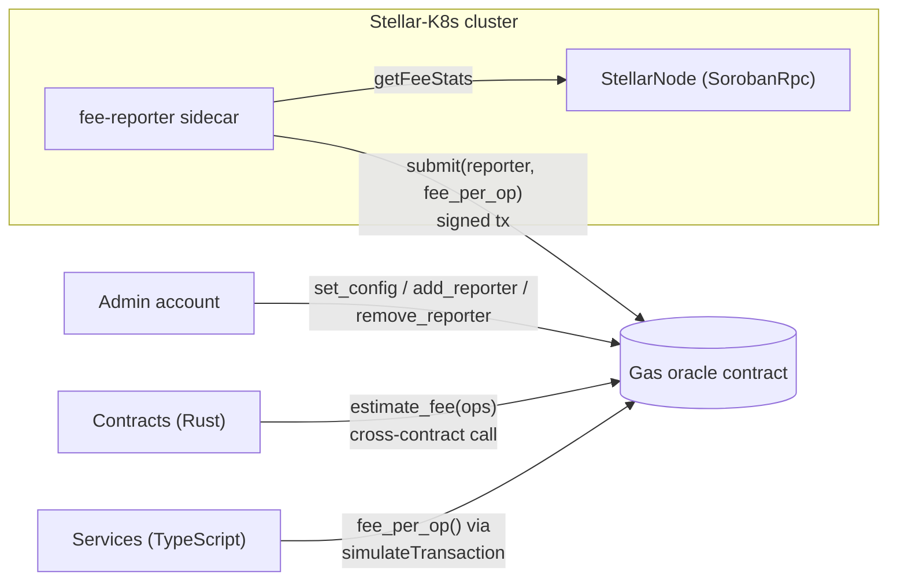

# Dynamic Gas Fee Oracle: Architecture Specification

This document specifies the gas fee oracle: a Soroban contract that publishes a
smoothed recommended inclusion fee for Stellar transactions. It covers:

- the fixed-point exponential moving average (EMA) the contract computes, with
  proofs of its range, overflow and precision bounds
- the contract ABI, its authorization rules and error codes
- how nodes managed by Stellar-K8s report fees, and how Rust contracts and
  TypeScript services read the quote

Rust and TypeScript client code lives in
[`examples/contracts/oracle-client/`](../../examples/contracts/oracle-client/).
The Rust crate's [`ema` module](../../examples/contracts/oracle-client/rust/src/ema.rs)
is the reference implementation of the arithmetic below. Any oracle
implementation must match it bit for bit.

## Contents

1. [Scope](#1-scope)
2. [Architecture](#2-architecture)
3. [Fixed-point EMA model](#3-fixed-point-ema-model)
4. [Precision and bounds proofs](#4-precision-and-bounds-proofs)
5. [Contract ABI](#5-contract-abi)
6. [Authorization rules](#6-authorization-rules)
7. [Error codes](#7-error-codes)
8. [Integration](#8-integration)
9. [Validation](#9-validation)

## 1. Scope

A Soroban transaction pays two fees:

| Component | Set by | Covered by the oracle |
|-----------|--------|-----------------------|
| Inclusion fee | The submitter's bid per operation. It is ranked against other bids when ledgers are congested. | Yes |
| Resource fee | Deterministic. `simulateTransaction` returns it for the exact footprint. | No. Keep using simulation. |

The oracle smooths the observed market inclusion fee so that callers get a bid
that follows congestion without chasing one-ledger spikes. Contracts can read
the value directly, which RPC-only fee statistics cannot offer: for example, a
contract that refunds relayers or prices metered calls.

All fees in this document are in **stroops** (10^-7 XLM).

## 2. Architecture



| Component | Responsibility |
|-----------|----------------|
| Oracle contract | Stores configuration, the reporter allowlist and EMA state. Serves quotes. |
| Reporter | An allowlisted account that submits at most one observation per ledger. |
| Admin | Configures smoothing, bounds and staleness, and manages reporters. |
| Consumers | Read quotes. Reads are free when simulated and need no authorization. |

## 3. Fixed-point EMA model

### 3.1 Notation and constants

| Symbol | Meaning | Value / type |
|--------|---------|--------------|
| `S` | Fixed-point scale: `E` is stored in units of 10^-7 stroops | `10_000_000` |
| `D` | Denominator of the smoothing factor | `10_000` |
| `a` | `alpha_bps`, the smoothing numerator | `u32`, `1 <= a <= D` |
| `α` | Smoothing factor | `a / D` |
| `x_t` | Observation `t`, in stroops per operation | `u64`, `min_fee <= x_t <= max_fee` |
| `X_t` | Observation in fixed point | `S * x_t` (`u128`) |
| `E_t` | Stored EMA after observation `t` | `u128` |
| `q_t` | Quote returned by `fee_per_op` | `u64` |

Every intermediate value is an unsigned integer and every division rounds
toward zero. There are no signed values and no floating point, so the result
is identical on every host.

### 3.2 Recurrence

The textbook EMA is `e_t = e_{t-1} + α (x_t − e_{t-1})`. It needs a signed
difference. The oracle uses the equivalent convex-combination form, which
stays non-negative:

```text
E_1 = X_1                                          (seed with the first sample)
E_t = floor( (a * X_t + (D − a) * E_{t−1}) / D )   for t ≥ 2
q_t = clamp( ceil(E_t / S), min_fee, max_fee )
```

### 3.3 Step-by-step evaluation

For each accepted observation `x_t`:

1. **Lift.** Compute `X_t = x_t * S`. This is exact.
2. **Weight the new sample.** Compute `A = a * X_t`. This is exact. `A` is
   divisible by `D` because `D` divides `S`.
3. **Weight the history.** Compute `B = (D − a) * E_{t−1}`. This is exact.
4. **Combine.** Compute `N_t = A + B`. This is exact (see
   [Lemma 2](#lemma-2-no-overflow)).
5. **Normalise.** Set `E_t = N_t / D`, rounding toward zero. This is the only
   lossy step. It discards the remainder `r_t = N_t mod D`, where
   `0 <= r_t <= D − 1`.
6. **Quote** (on read). Compute `q_t = ceil(E_t / S)`, then clamp it to
   `[min_fee, max_fee]`.

### 3.4 Worked example

With `a = 2000` (`α = 0.2`) and observations of 100, 150 and 137 stroops:

| t | `x_t` | `X_t` | `N_t` | `E_t` | `E_t / S` | `q_t` |
|---|-------|-------|-------|-------|-----------|-------|
| 1 | 100 | 1 000 000 000 | seed | 1 000 000 000 | 100.0 | 100 |
| 2 | 150 | 1 500 000 000 | 2000·1.5e9 + 8000·1.0e9 = 11 000 000 000 000 | 1 100 000 000 | 110.0 | 110 |
| 3 | 137 | 1 370 000 000 | 2000·1.37e9 + 8000·1.1e9 = 11 540 000 000 000 | 1 154 000 000 | 115.4 | 116 |

The `worked_example_from_spec` unit test and the `submit_updates_ema_as_specified`
integration test assert this table exactly.

### 3.5 Choosing `alpha_bps`

`α` sets how fast the quote follows the market:

- The equivalent simple-moving-average window is `N ≈ 2/α − 1`.
- The half-life (samples until a step change is half absorbed) is
  `h = ln 2 / −ln(1 − α)`.

| `alpha_bps` | `α` | Equivalent window `N` | Half-life `h` (samples) | Max truncation error `D/a` (units of 10^-7 stroops) |
|-------------|-----|-----------------------|-------------------------|-----------------------------|
| 500 | 0.05 | 39 | 13.51 | 20 |
| 2 000 | 0.20 | 9 | 3.11 | 5 |
| 5 000 | 0.50 | 3 | 1.00 | 2 |
| 10 000 | 1.00 | 1 | 0 (tracks the last sample) | 1 (no error: `N_t = D·X_t`) |

The recommended default is `alpha_bps = 2000`. With one sample per ledger
(about 5 s), a fee spike loses half its weight in about 16 seconds.

## 4. Precision and bounds proofs

Let `X_max = S · (2^64 − 1)`, the largest possible `X_t`. The fixed-point
state is only ever written by the recurrence in §3.2.

### Lemma 1 (Range)

*If every observation satisfies `L <= X_k <= U` for integers `L` and `U`, then
`L <= E_t <= U` for all `t`.*

**Proof.** By induction. For `t = 1`, `E_1 = X_1` lies in `[L, U]`. Assume
`L <= E_{t−1} <= U`. Both `X_t` and `E_{t−1}` lie in `[L, U]`, and their weights
`a` and `D − a` are non-negative and sum to `D`. So

```text
D·L <= N_t = a·X_t + (D − a)·E_{t−1} <= D·U
```

Dividing by `D` gives `L <= N_t / D <= U`. Since `L` and `U` are integers, the
floor stays in the range: `L <= floor(N_t / D) = E_t <= U`. ∎

**Corollary 1a.** `E_t <= X_max`. Also, while the configuration is unchanged,
`min_fee·S <= E_t <= max_fee·S`. The clamp in `q_t` only takes effect after
`set_config` narrows the bounds.

### Lemma 2 (No overflow)

*Every intermediate value in §3.3 fits in a `u128`, and `q_t` fits in a
`u64`.*

**Proof.** By Corollary 1a, `E_{t−1} <= X_max` and `X_t <= X_max`. Then

```text
N_t = a·X_t + (D − a)·E_{t−1} <= D·X_max = 10^4 · 10^7 · (2^64 − 1)
    < 2^37 · 2^64 = 2^101 < 2^128
```

because `10^11 < 2^37 ≈ 1.37 × 10^11`. This leaves at least 27 bits of
headroom. `A` and `B` are each at most `N_t`, so they fit as well.
Finally, `ceil(E_t / S) <= ceil(X_max / S) = 2^64 − 1`. ∎

`estimate_fee(ops)` multiplies the quote by `ops` and can exceed `u64`. The
contract uses a checked multiplication and returns `Overflow` (code 9) instead
of wrapping.

### Theorem 3 (Truncation error)

Let `ê_t` be the EMA computed exactly over the real numbers from the same
inputs: `ê_1 = X_1` and `ê_t = α·X_t + (1 − α)·ê_{t−1}`. Then for all `t`:

```text
0 <= ê_t − E_t < (1 − 1/D) / α <= D / a    (units of 10^-7 stroops)
```

**Proof.** Write `ε_t = ê_t − E_t`. Step 5 gives
`E_t = N_t / D − δ_t` with `δ_t = r_t / D ∈ [0, 1 − 1/D]`. Substituting
`N_t / D = α·X_t + (1 − α)·E_{t−1}`:

```text
ε_t = α·X_t + (1 − α)·ê_{t−1} − α·X_t − (1 − α)·E_{t−1} + δ_t
    = (1 − α)·ε_{t−1} + δ_t,        with ε_1 = 0.
```

Unrolling the recurrence gives `ε_t = Σ_{k=2..t} (1 − α)^{t−k} · δ_k`. Every
term is non-negative, so `ε_t >= 0`. Bounding each `δ_k` by `1 − 1/D` and
summing the geometric series:

```text
ε_t <= (1 − 1/D) · (1 − (1 − α)^{t−1}) / α < (1 − 1/D) / α < D / a. ∎
```

In stroops, the error is below `D / (a·S) = 1 / (1000·a)`. That is at most
`10^-3` stroops (at `a = 1`) and `5 × 10^-7` stroops at the default
`a = 2000`. The error does not grow with the number of samples.

### Corollary 4 (Quote accuracy)

*Let `q̂_t = ceil(ê_t / S)` be the ideal quote. Before clamping,
`q̂_t − 1 <= ceil(E_t / S) <= q̂_t`, and `ceil(E_t / S) > ê_t / S − 10^-3`.*

**Proof.**
- Upper bound: Theorem 3 gives `E_t <= ê_t`, so `ceil(E_t / S) <= q̂_t`.
- Lower bound: Theorem 3 also gives `ê_t − E_t < D/a <= D < S`, so
  `ê_t / S < E_t / S + 1`. Taking ceilings, `q̂_t <= ceil(E_t / S) + 1`.
- The second statement follows from
  `ceil(E_t / S) >= E_t / S > ê_t / S − D/(a·S)`. ∎

So the on-chain quote is never more than 10^-3 stroops below the exact EMA, and
never more than one stroop below the ideal rounded-up quote.

### Lemma 5 (Steady state)

*For a constant input `X_t = X`:*

- *If `E_{t−1} > X`, then `E_t < E_{t−1}`. The EMA reaches `X` exactly.*
- *If `E_{t−1} < X`, then `E_t >= E_{t−1}`. The EMA stops moving exactly when
  `a·(X − E_{t−1}) < D`, that is, within `D / a` units of `X`.*

**Proof.** Write `g = X − E_{t−1}`. Then
`E_t = floor(E_{t−1} + a·g / D) = E_{t−1} + floor(a·g / D)`.

- If `g < 0`, then `floor(a·g / D) <= −1`, so `E_t` strictly decreases.
  Lemma 1 keeps `E_t >= X`, so the sequence reaches `X` in finitely many steps.
- If `g > 0`, then `E_t = E_{t−1}` exactly when `a·g < D`. Otherwise `E_t`
  strictly increases, and Lemma 1 keeps `E_t <= X`. ∎

When the input is constant at `x`, the remaining gap is less than `D/a <= D < S`.
So `ceil(E_t / S) = x`, and the quote converges to the true fee. The unit test
`constant_input_converges_within_deadband` checks this.

## 5. Contract ABI

The canonical Rust interface is the `GasOracle` trait in
[`rust/src/lib.rs`](../../examples/contracts/oracle-client/rust/src/lib.rs).
In XDR, argument and field names are `snake_case`. Structs are encoded as
`ScMap` with symbol keys.

### 5.1 Types

```rust
pub struct OracleConfig {
    pub alpha_bps: u32,       // 1..=10_000
    pub min_fee: u64,         // >= 1, stroops per operation
    pub max_fee: u64,         // >= min_fee
    pub max_age_ledgers: u32, // >= 1
}

pub struct OracleState {
    pub ema: u128,             // E_t, units of 10^-7 stroops
    pub last_observation: u64, // x_t
    pub last_ledger: u32,      // ledger sequence of x_t
    pub samples: u64,          // accepted observations
}
```

A configuration is valid when **all** of these hold:
`1 <= alpha_bps <= 10_000`, `1 <= min_fee <= max_fee`, and
`max_age_ledgers >= 1`.

### 5.2 Functions

| Function | Parameters | Returns | Auth | Errors |
|----------|------------|---------|------|--------|
| `initialize` | `admin: Address`, `config: OracleConfig` | `()` | `admin` | 1, 4 |
| `set_config` | `config: OracleConfig` | `()` | stored admin | 2, 4 |
| `add_reporter` | `reporter: Address` | `()` | stored admin | 2 |
| `remove_reporter` | `reporter: Address` | `()` | stored admin | 2 |
| `submit` | `reporter: Address`, `fee_per_op: u64` | `u64`: the new quote | `reporter` | 2, 3, 5, 6 |
| `fee_per_op` | none | `u64`: the quote `q_t` | none | 2, 7, 8 |
| `estimate_fee` | `ops: u32` | `u64`: `q_t · ops` | none | 2, 7, 8, 9 |
| `state` | none | `OracleState` | none | 2, 7 |
| `config` | none | `OracleConfig` | none | 2 |

### 5.3 Semantics

**`submit`** applies these steps in order:

1. Load the configuration. If it is missing, fail with `NotInitialized`.
2. Call `reporter.require_auth()`.
3. Check reporter allowlist membership. Fail with `Unauthorized` if the
   reporter is not listed.
4. Check that `min_fee <= fee_per_op <= max_fee`. Otherwise fail with
   `ObservationOutOfRange`.
5. If the stored state has `last_ledger` equal to the current ledger, fail with
   `AlreadyUpdated`.
6. Seed the EMA (first sample) or apply §3.2, then set `last_observation`,
   `last_ledger` and `samples += 1`.
7. Return the quote for the new state.

**`fee_per_op`** fails with `NoData` before the first sample. It fails with
`Stale` when `current_ledger − last_ledger > max_age_ledgers`. Otherwise it
returns `q_t` from §3.2.

**`set_config`** keeps the EMA state. A new `alpha_bps` applies from the next
observation. Narrower bounds apply at once through the clamp in `q_t`.

### 5.4 Storage

| Key | Storage type | Value |
|-----|--------------|-------|
| `Admin` | instance | `Address` |
| `Config` | instance | `OracleConfig` |
| `State` | instance | `OracleState` |
| `Reporter(Address)` | persistent | `bool` |

Implementations should extend the instance TTL on `submit`, so that an active
oracle never expires.

## 6. Authorization rules

1. **Initialization is one-time.** `initialize` requires the `admin`
   signature and fails with `AlreadyInitialized` on any later call. Call it in
   the same transaction as deployment (or use a constructor), so that nobody
   can initialize a freshly deployed instance before you do.
2. **Only the admin changes configuration.** `set_config`, `add_reporter` and
   `remove_reporter` call `require_auth()` on the stored admin. A missing
   signature traps the host (it is not a contract error code).
3. **Only allowlisted reporters submit.** `submit` requires the signature of
   the `reporter` argument, which prevents one reporter spending another's
   identity. The address must also be on the allowlist, or the call fails
   with `Unauthorized`. Removing a reporter takes effect immediately.
4. **One observation per ledger.** This limits how far any single reporter,
   including a compromised one, can move the EMA. Each accepted observation
   moves `E` by at most `α·(max_fee − min_fee)` stroops (plus one fixed-point
   unit of rounding), and at most once per ledger.
   Tight `[min_fee, max_fee]` bounds are the second line of defence.
5. **Reads are public.** Query functions need no authorization and can be
   simulated for free.

The `signers_match_authorization_rules` integration test checks that `submit`
records only the reporter's signature, and that `add_reporter` records only
the admin's.

## 7. Error codes

Errors are returned as `Error(Contract, #n)`. In Rust they are the `try_*`
client variants' `Err(Ok(OracleError))`. TypeScript simulations report them
in the error string, and `parseOracleError` extracts the code.

| Code | Name | Raised when | Caller action |
|------|------|-------------|---------------|
| 1 | `AlreadyInitialized` | `initialize` is called twice | None. The contract is already configured. |
| 2 | `NotInitialized` | Any call before `initialize` | Check the contract ID. |
| 3 | `Unauthorized` | The reporter is not on the allowlist | Ask the admin to call `add_reporter`. |
| 4 | `InvalidConfig` | The configuration breaks the §5.1 rules | Fix the configuration. |
| 5 | `ObservationOutOfRange` | `fee_per_op` is outside `[min_fee, max_fee]` | Drop the sample, or ask the admin to widen the bounds. |
| 6 | `AlreadyUpdated` | Another sample was accepted this ledger | Benign. Retry on the next ledger. |
| 7 | `NoData` | No observation has been submitted | Use a fallback fee. |
| 8 | `Stale` | No update within `max_age_ledgers` | Use a fallback fee and alert on reporter health. |
| 9 | `Overflow` | `q_t · ops` exceeds `u64::MAX` | Reduce `ops`. |

## 8. Integration

### 8.1 Rust: calling the oracle from a contract

Add the client crate as a dependency and call through the generated
`GasOracleClient`. The `quote_fee` helper returns oracle errors so that the
caller can choose a fallback:

```rust
use gas_oracle_client::{quote_fee, OracleError};
use soroban_sdk::{panic_with_error, Address, Env};

const FALLBACK_FEE_PER_OP: u64 = 100;

pub fn relayer_refund(env: &Env, oracle: &Address, ops: u32) -> u64 {
    match quote_fee(env, oracle, ops) {
        Ok(fee) => fee,
        Err(OracleError::Stale | OracleError::NoData) => FALLBACK_FEE_PER_OP * ops as u64,
        Err(err) => panic_with_error!(env, err),
    }
}
```

The full ABI, including the admin and reporter calls, is available on
`GasOracleClient::new(&env, &oracle_id)`.

### 8.2 TypeScript: querying from a service

[`typescript/src/client.ts`](../../examples/contracts/oracle-client/typescript/src/client.ts)
simulates read-only calls through Soroban RPC:

```ts
import { Networks } from "@stellar/stellar-sdk";
import { GasOracleClient, OracleContractError, OracleError } from "./client.js";

const oracle = new GasOracleClient({
  rpcUrl: "https://soroban-testnet.stellar.org",
  networkPassphrase: Networks.TESTNET,
  contractId: process.env.ORACLE_CONTRACT_ID!,
});

const ops = 3; // operations in the transaction being built
const inclusionFee = await oracle.estimateFee(ops).catch((err) => {
  if (err instanceof OracleContractError && err.code === OracleError.Stale) return 100n * BigInt(ops);
  throw err;
});
// Total fee = inclusion fee (oracle) + resource fee (simulateTransaction).
```

### 8.3 Node integration: the fee reporter

Run a reporter as a [sidecar](../sidecars.md) next to each `SorobanRpc`
`StellarNode` the operator manages. On every new ledger it:

1. Calls the local RPC's `getFeeStats`, and reads a percentile of
   `sorobanInclusionFee` (`p50` by default) as `fee_per_op`.
2. Skips the round if the value lies outside `[min_fee, max_fee]` from
   `config()`.
3. Signs and submits `submit(reporter, fee_per_op)` with a key mounted from a
   Kubernetes Secret (see [Vault integration](../vault-stellar-tutorial.md)).
4. Treats `AlreadyUpdated` as success. With several replicas reporting, the
   first sample in each ledger wins, which gives failover without leader
   election.
5. Exports the last accepted ledger as a metric, and alerts before
   `max_age_ledgers` is reached so that consumers do not see `Stale`.

## 9. Validation

| Check | How |
|-------|-----|
| Worked example (§3.4) | `ema::tests::worked_example_from_spec` |
| Theorem 3 bound for `a ∈ {1, 7, 333, 2000, 9999}` over 5 000 random samples | `ema::tests::truncation_error_stays_within_proven_bound`. It compares against a reference carrying 12 extra digits. |
| Lemma 2 at `u64::MAX` inputs | `ema::tests::extreme_inputs_do_not_overflow` (debug builds trap on overflow) |
| Lemma 5 deadband | `ema::tests::constant_input_converges_within_deadband` |
| ABI, error codes and authorization | `rust/tests/client.rs`. It runs `GasOracleClient` against a mock contract that implements §5 in the Soroban host. |
| TypeScript error decoding | `typescript/src/client.test.ts` |

To run the suites:

```sh
cd examples/contracts/oracle-client/rust && cargo test
cd examples/contracts/oracle-client/typescript && npm install && npm test
```

To check a deployment on testnet, use the oracle's contract ID:

```sh
stellar contract invoke --id "$ORACLE_CONTRACT_ID" --network testnet -- config
stellar contract invoke --id "$ORACLE_CONTRACT_ID" --network testnet -- fee_per_op
cd examples/contracts/oracle-client/typescript && ORACLE_CONTRACT_ID="$ORACLE_CONTRACT_ID" npm run example
```

`fee_per_op` from the CLI and from the TypeScript example must agree. To
confirm §3.2 on-chain, submit a known sequence as a reporter and compare
`state().ema` with the values from `ema::update`.
