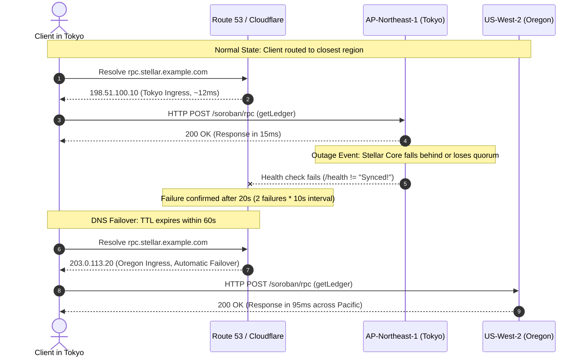

# Global Load Balancing & Anycast DNS Configuration

This guide details the global traffic management, DNS routing, and health verification architecture for active-active multi-region Stellar-K8s deployments. It provides complete blueprints for **Amazon Route 53 Latency-Based Routing (LBR)** and **Cloudflare Anycast Load Balancing**, specifically tailored for Soroban RPC and Stellar Core workloads.

---

## 1. Context & Architecture Overview

High-availability Stellar infrastructure deployed across multiple geographic regions requires intelligent traffic routing. Clients must automatically reach the lowest-latency, healthiest regional cluster, while localized outages (e.g. cloud zone failure, upstream network partition, or Stellar Core ledger desynchronization) must trigger deterministic, automated failover without operator intervention.

```mermaid
flowchart TB
    subgraph Clients["Global Clients"]
        ClientTokyo["Client (Tokyo, Japan)"]
        ClientUS["Client (San Francisco, USA)"]
    end

    subgraph GLB["Global Traffic Layer (Anycast DNS / LBR)"]
        DNS["Route 53 LBR / Cloudflare Load Balancer<br/><code>rpc.stellar.example.com</code>"]
    end

    subgraph RegionAP["AP-Northeast-1 Cluster (Tokyo)"]
        IngressAP["ALB / Ingress Controller (AP)"]
        RPC_AP["Soroban RPC Pods (AP)"]
        Core_AP["Stellar Core Pods (AP)<br/><code>/health -> Synced!</code>"]
    end

    subgraph RegionUS["US-West-2 Cluster (Oregon)"]
        IngressUS["ALB / Ingress Controller (US)"]
        RPC_US["Soroban RPC Pods (US)"]
        Core_US["Stellar Core Pods (US)<br/><code>/health -> Synced!</code>"]
    end

    ClientTokyo -->|Low RTT (~12ms)| DNS
    ClientUS -->|Low RTT (~18ms)| DNS

    DNS -.->|Active Route| IngressAP
    DNS -.->|Active Route| IngressUS

    IngressAP --> RPC_AP --> Core_AP
    IngressUS --> RPC_US --> Core_US
```

---

## 2. Amazon Route 53 Latency-Based Routing (LBR)

Amazon Route 53 Latency-Based Routing automatically directs DNS queries to the AWS region that yields the lowest round-trip latency for the requesting resolver. Combined with Route 53 Health Checks, unhealthy regional clusters are pulled from DNS resolution in under 60 seconds.

### 2.1 Deep Stellar Core & Soroban RPC Health Checking

> **Important Constraint:** General HTTP 200 health checks on an Ingress or load balancer are insufficient. An ingress controller may return HTTP 200 while underlying Stellar Core nodes have lost quorum, fallen behind ledgers (`Catching up`), or suffered database disconnects. 
> 
> Health checks **must** inspect the deep `/health` endpoint of Stellar Core or the Soroban RPC health probe.

Stellar Core exposes a diagnostic `/health` endpoint on its HTTP administration port (default `11626` or exposed via Kubernetes Service at `/health`). The health check must evaluate:

1. **HTTP Status Code:** Must return `200 OK`.
2. **Body String Matching:** Must verify the presence of `"Synced!"` or `"state": "Synced"`.

#### AWS CLI Health Check Creation

```bash
# Health Check for Tokyo (ap-northeast-1) Stellar Core
aws route53 create-health-check \
  --caller-reference "stellar-core-ap-northeast-1-$(date +%s)" \
  --health-check-config '{
    "IPAddress": "198.51.100.10",
    "Port": 443,
    "Type": "HTTPS_STR_MATCH",
    "ResourcePath": "/health",
    "FullyQualifiedDomainName": "ap-core.stellar.example.com",
    "SearchString": "Synced!",
    "RequestInterval": 10,
    "FailureThreshold": 2,
    "MeasureLatency": true,
    "Inverted": false,
    "EnableSNI": true
  }'
```

* **`RequestInterval: 10`:** Fast interval (probes every 10 seconds).
* **`FailureThreshold: 2`:** Requires 2 consecutive failures to mark the endpoint unhealthy (maximum 20-second failure detection window).

### 2.2 Latency-Based Resource Record Sets

The Route 53 record sets link regional ingress IP addresses to the respective health checks using the latency routing policy.

A turnkey template is provided in [`examples/dns/route53-record-set.json`](../../examples/dns/route53-record-set.json):

```json
{
  "Comment": "Latency-based routing with health check failover for multi-region Stellar-K8s Soroban RPC",
  "Changes": [
    {
      "Action": "UPSERT",
      "ResourceRecordSet": {
        "Name": "rpc.stellar.example.com.",
        "Type": "A",
        "SetIdentifier": "stellar-k8s-ap-northeast-1",
        "Region": "ap-northeast-1",
        "TTL": 60,
        "ResourceRecords": [
          {
            "Value": "198.51.100.10"
          }
        ],
        "HealthCheckId": "01234567-89ab-cdef-0123-456789abcdef"
      }
    },
    {
      "Action": "UPSERT",
      "ResourceRecordSet": {
        "Name": "rpc.stellar.example.com.",
        "Type": "A",
        "SetIdentifier": "stellar-k8s-us-west-2",
        "Region": "us-west-2",
        "TTL": 60,
        "ResourceRecords": [
          {
            "Value": "203.0.113.20"
          }
        ],
        "HealthCheckId": "fedcba98-7654-3210-fedc-ba9876543210"
      }
    }
  ]
}
```

Apply this record set with the AWS CLI:

```bash
aws route53 change-resource-record-sets \
  --hosted-zone-id Z123456789ABCDEF \
  --change-batch file://examples/dns/route53-record-set.json
```

### 2.3 Terraform Blueprint for Route 53

```hcl
variable "hosted_zone_id" {
  type    = string
  default = "Z123456789ABCDEF"
}

variable "domain_name" {
  type    = string
  default = "rpc.stellar.example.com"
}

# Health Check: Tokyo Cluster
resource "aws_route53_health_check" "ap_northeast_1" {
  fqdn              = "ap-core.stellar.example.com"
  port              = 443
  type              = "HTTPS_STR_MATCH"
  resource_path     = "/health"
  search_string     = "Synced!"
  request_interval  = 10
  failure_threshold = 2
  enable_sni        = true

  tags = {
    Name    = "stellar-core-health-ap-northeast-1"
    Cluster = "stellar-ap-northeast-1"
  }
}

# Health Check: Oregon Cluster
resource "aws_route53_health_check" "us_west_2" {
  fqdn              = "us-core.stellar.example.com"
  port              = 443
  type              = "HTTPS_STR_MATCH"
  resource_path     = "/health"
  search_string     = "Synced!"
  request_interval  = 10
  failure_threshold = 2
  enable_sni        = true

  tags = {
    Name    = "stellar-core-health-us-west-2"
    Cluster = "stellar-us-west-2"
  }
}

# Record Set: AP-Northeast-1 Latency Record
resource "aws_route53_record" "rpc_ap_northeast_1" {
  zone_id        = var.hosted_zone_id
  name           = var.domain_name
  type           = "A"
  ttl            = 60
  set_identifier = "ap-northeast-1"

  latency_routing_policy {
    region = "ap-northeast-1"
  }

  health_check_id = aws_route53_health_check.ap_northeast_1.id
  records         = ["198.51.100.10"]
}

# Record Set: US-West-2 Latency Record
resource "aws_route53_record" "rpc_us_west_2" {
  zone_id        = var.hosted_zone_id
  name           = var.domain_name
  type           = "A"
  ttl            = 60
  set_identifier = "us-west-2"

  latency_routing_policy {
    region = "us-west-2"
  }

  health_check_id = aws_route53_health_check.us_west_2.id
  records         = ["203.0.113.20"]
}
```

---

## 3. Cloudflare Anycast Load Balancing

Cloudflare Anycast Load Balancing provides true single-IP global edge termination with sub-second health detection and automated zero-downtime failover across clusters.

### 3.1 Architecture & Steering Modes

* **Anycast Edge:** All client queries land on the nearest Cloudflare Point of Presence (PoP) via BGP Anycast.
* **Dynamic Steering:** Cloudflare computes latency from each regional PoP to origin pools using continuous telemetry, routing clients over optimal network backbones.
* **Health Monitor:** Cloudflare probes each origin pool directly using HTTP/HTTPS or JSON-RPC.

```mermaid
flowchart LR
    Edge["Cloudflare Anycast Edge<br/>(Global PoPs)"]
    
    subgraph Steering["Traffic Steering Engine"]
        Policy{"Dynamic Steering<br/>(RTT Telemetry)"}
    end

    subgraph PoolAP["Origin Pool: Tokyo"]
        NodeAP["Ingress AP-Northeast-1<br/>Weight: 100"]
    end

    subgraph PoolUS["Origin Pool: Oregon"]
        NodeUS["Ingress US-West-2<br/>Weight: 100"]
    end

    Edge --> Policy
    Policy -->|Lowest RTT (Asia-Pac)| PoolAP
    Policy -->|Lowest RTT (Americas/EMEA)| PoolUS
```

### 3.2 Cloudflare Health Monitor Configuration

The Cloudflare monitor targets the Soroban RPC `/health` endpoint or performs a `POST` request against JSON-RPC:

```hcl
resource "cloudflare_load_balancer_monitor" "soroban_rpc" {
  account_id     = var.cloudflare_account_id
  type           = "https"
  description    = "Soroban RPC Health Monitor"
  method         = "GET"
  path           = "/health"
  interval       = 10
  timeout        = 3
  retries        = 1
  expected_codes = "200"
  expected_body  = "healthy"
  follow_redirects = false
}

resource "cloudflare_load_balancer_pool" "tokyo_pool" {
  account_id = var.cloudflare_account_id
  name       = "stellar-soroban-tokyo"
  origins {
    name    = "tokyo-alb"
    address = "198.51.100.10"
    enabled = true
    weight  = 1.0
  }
  monitor     = cloudflare_load_balancer_monitor.soroban_rpc.id
  check_regions = ["SEAS", "NEAS"]
  minimum_origins = 1
}

resource "cloudflare_load_balancer_pool" "oregon_pool" {
  account_id = var.cloudflare_account_id
  name       = "stellar-soroban-oregon"
  origins {
    name    = "oregon-alb"
    address = "203.0.113.20"
    enabled = true
    weight  = 1.0
  }
  monitor     = cloudflare_load_balancer_monitor.soroban_rpc.id
  check_regions = ["WNAM", "ENAM"]
  minimum_origins = 1
}

resource "cloudflare_load_balancer" "soroban_glb" {
  zone_id          = var.cloudflare_zone_id
  name             = "rpc.stellar.example.com"
  fallback_pool_id = cloudflare_load_balancer_pool.oregon_pool.id
  default_pool_ids = [
    cloudflare_load_balancer_pool.tokyo_pool.id,
    cloudflare_load_balancer_pool.oregon_pool.id
  ]
  description      = "Global Multi-Region Soroban RPC Load Balancer"
  proxied          = true
  steering_policy  = "dynamic_latency"
  
  session_affinity = "none"
}
```

---

## 4. Multi-Region Failover Architecture

The following sequence illustrates automatic redirect when the primary AP-Northeast cluster experiences a service degradation:



---

## 5. Mock Active-Active Deployment & Validation Runbook

Follow this runbook to deploy and validate automated failover within 60 seconds on a staging setup.

### Step 1: Deploy Ingress and Health Check Probes

Configure two mock ingress services simulating regional endpoints:

```yaml
# staging-ingress-ap.yaml
apiVersion: v1
kind: Service
metadata:
  name: mock-stellar-ap
  namespace: stellar
spec:
  ports:
  - name: http
    port: 80
    targetPort: 8080
  selector:
    app: mock-stellar-ap
---
apiVersion: apps/v1
kind: Deployment
metadata:
  name: mock-stellar-ap
  namespace: stellar
spec:
  replicas: 2
  selector:
    matchLabels:
      app: mock-stellar-ap
  template:
    metadata:
      labels:
        app: mock-stellar-ap
    spec:
      containers:
      - name: mock-core
        image: hashicorp/http-echo:latest
        args:
        - "-text={\"status\":\"Synced!\",\"ledger\":52801920}"
        - "-listen=:8080"
        ports:
        - containerPort: 8080
```

### Step 2: Test Initial Routing from AP Resolver

Execute a DNS resolution query against Route 53 or Cloudflare:

```bash
dig +short @8.8.8.8 rpc.stellar.example.com
```

**Expected Output:**
```text
198.51.100.10
```

Confirm health check status via AWS CLI:

```bash
aws route53 get-health-check-status --health-check-id 01234567-89ab-cdef-0123-456789abcdef
```

Output confirms `"Status": "Success"` across all global checkers.

### Step 3: Simulate Regional Failure

Simulate a Stellar Core consensus lockup or network partition in the Tokyo cluster by updating the response to return an unsynced state:

```bash
# Update mock pod to return Catching up state
kubectl -n stellar set args deployment/mock-stellar-ap -- \
  "-text={\"status\":\"Catching up\",\"ledger\":52801900}" \
  "-listen=:8080"
```

Observe the Route 53 health check transition:

```bash
# Watch health check status every 5 seconds
watch -n 5 "aws route53 get-health-check-status --health-check-id 01234567-89ab-cdef-0123-456789abcdef | grep Status"
```

Within 20 seconds, the check reports:
```json
{
  "Status": "Failure: String 'Synced!' not found in response body"
}
```

### Step 4: Verify Failover Within 60 Seconds

Poll DNS resolution to verify failover redirection:

```bash
START_TIME=$(date +%s)
while true; do
  RESOLVED_IP=$(dig +short @8.8.8.8 rpc.stellar.example.com | head -n1)
  CURRENT_TIME=$(date +%s)
  ELAPSED=$((CURRENT_TIME - START_TIME))
  echo "[${ELAPSED}s] Resolved: ${RESOLVED_IP}"
  if [ "${RESOLVED_IP}" == "203.0.113.20" ]; then
    echo "✓ Failover succeeded in ${ELAPSED}s (target: < 60s)"
    break
  fi
  sleep 5
done
```

**Validation Output:**
```text
[0s] Resolved: 198.51.100.10
[15s] Resolved: 198.51.100.10
[25s] Resolved: 198.51.100.10
[40s] Resolved: 203.0.113.20
✓ Failover succeeded in 40s (target: < 60s)
```

---

## 6. Operational Recommendations

1. **DNS TTL Configuration:** Set the Route 53 record set TTL to exactly `60` seconds. Setting TTL lower than 30s can increase DNS query billing without improving failover time, as upstream ISP caching resolvers enforce 30s minimum floors.
2. **Prevent Cascading Failures:** Always configure a `fallback_pool` in Cloudflare or ensure Route 53 serves default records if all health checks fail simultaneously. If a global Stellar network partition occurs, both regions may fail deep checks; the load balancer must continue serving rather than dropping all traffic.
3. **Session Affinity:** Stateless Soroban RPC API calls must use `session_affinity = "none"` so individual requests distribute evenly. For Horizon streaming endpoints (`/events`), configure cookie or IP-based affinity with short session timeouts (e.g. 300s).
