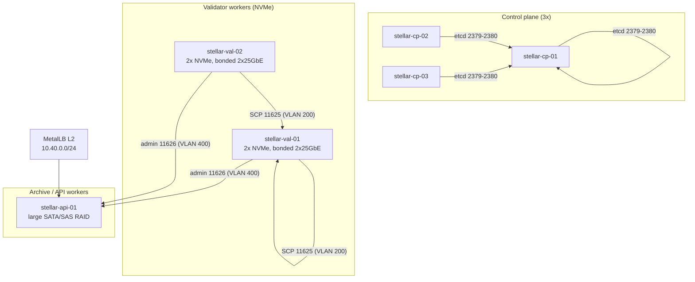

# Bare-Metal Kubernetes Bootstrap Guide for Stellar

This guide takes you from unboxed physical servers to a Stellar-K8s cluster running a
`StellarNode` on directly-attached NVMe storage — with **no dependency on any cloud
provider**. It is written for infrastructure engineers who need the cost profile of
owned hardware without giving up the operational model of Kubernetes.

> **Nothing in this guide requires a cloud-managed LoadBalancer or StorageClass.** Every
> component (Talos Linux, Cilium, MetalLB, Local Path Provisioner, OpenEBS) is either
> upstream open source or shipped by this repository.

Two bootstrap paths are documented:

| Path | Best for | Section |
|---|---|---|
| **Talos Linux** (recommended) | Immutable, API-driven nodes; no SSH/package drift | [4A](#4a-provision-with-talos-linux-recommended) |
| **kubeadm** on a general-purpose distro | Teams with an existing RHEL/Ubuntu fleet and config-management tooling | [4B](#4b-provision-with-kubeadm) |

Both converge on the same storage ([section 5](#5-attach-local-nvme-to-stellarnode)) and
network ([section 6](#6-physical-network-topology)) design.

---

## 1. When bare metal is the right call

| Factor | Cloud VM | Bare metal |
|---|---|---|
| Cost at 100 TB+ archival scale | High, grows with egress | Flat hardware + power/colo |
| NVMe I/O latency | Noisy-neighbour variance | Predictable, dedicated |
| SCP network jitter | Shared host NIC | Dedicated bonded NICs |
| Failure domain | Provider-managed | **You** own it |
| Elasticity | Instant | Capacity-plan ahead |

Bare metal is worth it when a Mainnet validator or history archive has outgrown
cloud storage economics. The trade-off is that storage attachment, node identity, and
network segmentation become *your* responsibility — which is exactly what the rest of
this guide documents.

---

## 2. Reference architecture



**Minimum viable topology:** 3 control-plane nodes + 2 workers with local NVMe. A single
worker is possible for a test/validation lab but gives you no scheduling headroom for
rolling updates.

### Node roles and sizing

| Role | Count | CPU | RAM | System disk | Data disk |
|---|---|---|---|---|---|
| Control plane | 3 | 4 vCPU | 16 GiB | 200 GB SSD | — |
| Validator worker | ≥2 | 8–16 vCPU | 32–64 GiB | 200 GB SSD | ≥2 × 2 TB NVMe |
| Horizon / RPC worker | ≥2 | 8 vCPU | 32 GiB | 200 GB SSD | 1–2 TB NVMe or RAID |
| Archive worker | ≥1 | 4 vCPU | 16 GiB | 200 GB SSD | 8 TB+ RAID6/SAS |

> **Sizing rule of thumb.** A Mainnet validator with `historyMode: Full` needs
> **1.5 TB** of fast local disk (the operator defaults to `1500Gi` when `spec.storage.size`
> is empty). Testnet and `Recent` history fit comfortably in 100–500 GiB. Size the NVMe
> for peak ledger + bucket growth, not today's usage.

### BIOS/firmware prerequisites

Set these on every server before installing an OS:

- **UEFI boot**, Secure Boot either consistently on or off cluster-wide.
- **Above 4G Decoding** enabled (required for large NVMe BAR mapping).
- **SR-IOV / VT-d / IOMMU** enabled if you plan to use SR-IOV or a user-space datapath.
- **Hyper-Threading on**, but keep SMT siblings in the CPU manager's full-pcpus pool.
- **Power profile = Maximum Performance** (do not let firmware park cores — consensus
  latency is sensitive to C-state wake-up jitter).
- **Boot order**: NIC → system NVMe; never boot from the data NVMe.

---

## 3. Label your hardware classes

Consistent labels are what let `StellarNode` scheduling and the storage design line up.
Apply them to **every** node at provisioning time (Talos does this declaratively in
[section 4A](#4a-provision-with-talos-linux-recommended)):

| Label | Example | Purpose |
|---|---|---|
| `stellar.io/node-class` | `validator`, `horizon`, `archive` | Pool separation |
| `stellar.io/nvme` | `"true"` | Target for `spec.storage.nodeAffinity` |
| `stellar.io/nvme-count` | `"2"` | Capacity-aware scheduling |
| `topology.kubernetes.io/zone` | `rack-a` | Failure-domain spreading |
| `feature.node.kubernetes.io/*` | (NFD, optional) | Hardware generation pinning |

```bash
# After the node has joined
kubectl label node stellar-val-01 \
  stellar.io/node-class=validator \
  stellar.io/nvme=true \
  stellar.io/nvme-count=2 \
  topology.kubernetes.io/zone=rack-a
```

---

## 4A. Provision with Talos Linux (recommended)

Talos ships as an immutable image with a gRPC management API and no shell. Machine state
is declared in YAML, which makes bare-metal nodes reproducible and eliminates
configuration drift across a fleet.

### 4A.1 Prepare the management workstation

```bash
# Pin a Talos version (never track latest in production)
export TALOS_VERSION=v1.8.2
curl -sLo /usr/local/bin/talosctl \
  "https://github.com/siderolabs/talos/releases/download/${TALOS_VERSION}/talosctl-linux-amd64"
chmod +x /usr/local/bin/talosctl
talosctl version --client
```

Boot each server from the Talos metal ISO / PXE image and note its maintenance-mode IP.
Nodes boot into maintenance mode with no configuration — nothing is written to disk until
you apply a machine config.

### 4A.2 Generate the cluster secrets and base config

```bash
talosctl gen config stellar-baremetal https://10.10.0.11:6443 \
  --output-dir _out
# _out/ contains controlplane.yaml, worker.yaml, talosconfig
export TALOSCONFIG="$PWD/_out/talosconfig"
```

### 4A.3 Patch: install disk, hostname, API SANs

Create `patches/00-install.yaml`. Apply per-node patches if the install disk differs.

```yaml
machine:
  install:
    disk: /dev/nvme0n1          # OS disk — NOT the data disk
    image: ghcr.io/siderolabs/installer:v1.8.2
    wipe: true
  nodeLabels:
    stellar.io/node-class: validator
    stellar.io/nvme: "true"
    stellar.io/nvme-count: "2"
cluster:
  apiServer:
    certSANs:
      - stellar-cp-01
      - stellar-api.stellar.internal
      - 10.10.0.11
  allowSchedulingOnControlPlanes: false
```

> **Guard rail.** `wipe: true` combined with the wrong `install.disk` destroys the data
> disk. Triple-check device paths (`lsblk -o NAME,SIZE,MODEL`) before applying, and keep
> the OS and data NVMe models/sizes different where possible.

### 4A.4 Patch: bonded NICs and VLANs

Create `patches/10-network.yaml`. This bonds two 25 GbE ports with LACP and layers the
management, SCP, and public VLANs on top. See [section 6](#6-physical-network-topology)
for the VLAN plan.

```yaml
machine:
  network:
    hostname: stellar-val-01
    nameservers:
      - 10.10.0.53
    interfaces:
      - interface: bond0
        mtu: 9000
        bond:
          mode: 802.3ad
          lacpRate: fast
          xmitHashPolicy: layer3+4
          interfaces:
            - eth0
            - eth1
        addresses:
          - 10.200.0.21/24          # SCP VLAN 200 (jumbo)
        routes:
          - network: 0.0.0.0/0
            gateway: 10.200.0.1
        vlans:
          - vlanId: 100
            mtu: 1500
            addresses:
              - 10.10.0.21/24        # management VLAN 100
          - vlanId: 400
            mtu: 1500
            addresses:
              - 10.40.0.21/24        # public VLAN 400
```

### 4A.5 Patch: mount the data NVMe for local storage

Create `patches/20-nvme.yaml`. Talos mounts the partitions on the host and `extraMounts`
propagates them into the kubelet so the local provisioner can use them.

```yaml
machine:
  disks:
    - device: /dev/nvme1n1
      partitions:
        - mountpoint: /var/mnt/stellar
    - device: /dev/nvme2n1
      partitions:
        - mountpoint: /var/mnt/archive
  kubelet:
    extraMounts:
      - destination: /var/mnt/stellar
        type: bind
        source: /var/mnt/stellar
        options:
          - bind
          - rshared
          - rw
      - destination: /var/mnt/archive
        type: bind
        source: /var/mnt/archive
        options:
          - bind
          - rshared
          - rw
  sysctls:
    net.core.rmem_max: "134217728"
    net.core.wmem_max: "134217728"
    fs.inotify.max_user_instances: "8192"
  time:
    servers:
      - ntp1.stellar.internal
      - ntp2.stellar.internal
```

> **Why `rshared`?** The local provisioner creates subdirectories under the host path and
> bind-mounts them into pods. Without shared mount propagation the pod never sees the
> mount. This is the single most common cause of `local-path` volumes that appear bound but
> are empty inside the container.

### 4A.6 Apply config, bootstrap, and install a CNI

```bash
# Per node — repeat with the right patches/hostname for each server
talosctl apply-config --insecure \
  --nodes 10.10.0.21 \
  --file _out/worker.yaml \
  --config-patch @patches/00-install.yaml \
  --config-patch @patches/10-network.yaml \
  --config-patch @patches/20-nvme.yaml

# First control-plane node only
talosctl bootstrap --nodes 10.10.0.11 --endpoints 10.10.0.11

talosctl kubeconfig --nodes 10.10.0.11 --endpoints 10.10.0.11 ./kubeconfig
export KUBECONFIG="$PWD/kubeconfig"
```

Talos ships **no CNI by default** (and `talosctl gen config` may pre-set Flannel), so
nodes stay `NotReady` until a CNI is installed. Explicitly set
`cluster.network.cni.name: none` and disable kube-proxy so Cilium can replace it:

```yaml
# patches/30-cni.yaml
cluster:
  proxy:
    disabled: true
  network:
    cni:
      name: none
    podSubnets:
      - 10.244.0.0/16
    serviceSubnets:
      - 10.96.0.0/12
```

```bash
helm repo add cilium https://helm.cilium.io/ && helm repo update
helm install cilium cilium/cilium --namespace kube-system \
  --set kubeProxyReplacement=true \
  --set routingMode=native \
  --set autoDirectNodeRoutes=true \
  --set ipv4NativeRoutingCIDR=10.244.0.0/16 \
  --set devices='{bond0.200,bond0.400}' \
  --set bpf.masquerade=true

kubectl -n kube-system rollout status ds/cilium --timeout=300s
kubectl get nodes -o wide
```

Cilium in `native` routing mode removes the VXLAN encapsulation tax on the fabric — the
preferred layout for L3-routable racks. If your ToR cannot route pod CIDRs, fall back to
`routingMode=tunnel` (see [Topology and CNI Integration](../networking/topology-cni.md)).

---

## 4B. Provision with kubeadm

Use this path when you must reuse an existing RHEL/Ubuntu image.

### 4B.1 Base OS setup (every node)

```bash
# Kernel and runtime prerequisites
sudo swapoff -a
sudo sed -i '/ swap / s/^/#/' /etc/fstab
sudo modprobe overlay
sudo modprobe br_netfilter
cat <<'EOF' | sudo tee /etc/modules-load.d/k8s.conf
overlay
br_netfilter
EOF
cat <<'EOF' | sudo tee /etc/sysctl.d/99-kubernetes-cri.conf
net.bridge.bridge-nf-call-iptables  = 1
net.bridge.bridge-nf-call-ip6tables = 1
net.ipv4.ip_forward                 = 1
net.core.rmem_max                   = 134217728
EOF
sudo sysctl --system
```

Install `containerd` (with `SystemdCgroup = true` in `/etc/containerd/config.toml`) and
`kubelet`/`kubeadm`/`kubectl` pinned to the same minor version across the fleet. Pin the
kernel and container runtime versions with your config-management tool — version skew
between kubelet minors is a hard failure.

### 4B.2 Initialize and join

```bash
# On the first control-plane node
sudo kubeadm init \
  --control-plane-endpoint "stellar-api.stellar.internal:6443" \
  --upload-certs \
  --pod-network-cidr=10.244.0.0/16 \
  --service-cidr=10.96.0.0/12

mkdir -p "$HOME/.kube"
sudo cp /etc/kubernetes/admin.conf "$HOME/.kube/config"
sudo chown "$(id -u):$(id -g)" "$HOME/.kube/config"
```

Join the remaining control-plane nodes with the `--control-plane` token, then join workers.
Because kubeadm (unlike Talos) ships kube-proxy by default, either keep kube-proxy and run
Cilium with `kubeProxyReplacement=false`, **or** remove kube-proxy before installing
Cilium:

```bash
kubectl -n kube-system delete ds kube-proxy
kubectl -n kube-system delete cm kube-proxy
helm install cilium cilium/cilium --namespace kube-system \
  --set kubeProxyReplacement=true --set routingMode=native \
  --set autoDirectNodeRoutes=true --set ipv4NativeRoutingCIDR=10.244.0.0/16
```

### 4B.3 Host networking and storage mounts

On kubeadm hosts, bonding/VLANs are configured with `netplan`/`nmcli` (or networkd) and
the data NVMe is mounted via `/etc/fstab` with `xfs`:

```bash
sudo mkfs.xfs -f -L stellar-data /dev/nvme1n1
echo 'LABEL=stellar-data /var/mnt/stellar xfs defaults,noatime,nodiratime 0 2' | sudo tee -a /etc/fstab
sudo mkdir -p /var/mnt/stellar && sudo mount -a
```

> **Mount propagation matters here too.** If the data path is a separate filesystem, systemd
> marks it `shared` by default, which is what the provisioner needs. Verify with
> `findmnt -o TARGET,PROPAGATION /var/mnt/stellar` — it must report `shared`.

---

## 5. Attach local NVMe to StellarNode

`StellarNode` supports two storage modes:

| `spec.storage.mode` | Behavior | Use when |
|---|---|---|
| `PersistentVolume` (default) | Dynamic PVC from the named `storageClass` | Replicated/network storage |
| `Local` | PVC from a node-local class; the pod is pinned to that node | Direct NVMe attachment |

For bare metal you want `mode: Local`. The operator applies
`spec.storage.nodeAffinity` to the **pod**, so the scheduler places the node on the
physical server that owns the disk *before* the local provisioner creates the PV.

### 5.1 Pick a provisioner

| Provisioner | Replication | Snapshots | Complexity | Recommendation |
|---|---|---|---|---|
| **Local Path Provisioner** | None (node-local) | No | Lowest | Default for validator/local NVMe |
| **OpenEBS LocalPV (Hostpath/LVM/ZFS)** | None | LVM/ZFS only | Medium | When you want block-level control |
| **OpenEBS Mayastor** | Yes (`repl: 3`) | Yes | High | HA storage without a SAN |

None of these depend on a cloud API, which is exactly why they are used here.

### 5.2 Install Local Path Provisioner

```bash
# Pin the version — do not track main
kubectl apply -f \
  https://raw.githubusercontent.com/rancher/local-path-provisioner/v0.0.30/deploy/local-path-storage.yaml
kubectl -n local-path-storage rollout status deploy/local-path-provisioner
```

Point it at the mounted NVMe by overriding its ConfigMap, then create the StorageClass:

```bash
kubectl -n local-path-storage create configmap local-path-config \
  --from-literal=config.json='{
    "nodePathMap": [
      {"node": "DEFAULT_PATH_FOR_NON_LISTED_NODES", "paths": ["/opt/local-path-provisioner"]},
      {"node": "stellar-val-01", "paths": ["/var/mnt/stellar/local-path"]},
      {"node": "stellar-val-02", "paths": ["/var/mnt/stellar/local-path"]}
    ]
  }' \
  --from-literal=setup='#!/bin/sh
set -eu
mkdir -m 0777 -p "$VOL_DIR"' \
  --dry-run=client -o yaml | kubectl apply -f -
```

The `/opt/local-path-provisioner` entry is the fallback for nodes without a dedicated
NVMe mount, so a badly-labelled pod fails loudly on a slow path instead of silently
landing somewhere unexpected.

### 5.3 Install OpenEBS (alternative)

```bash
helm repo add openebs https://openebs.github.io/charts && helm repo update
helm install openebs openebs/openebs \
  --namespace openebs --create-namespace \
  --set localpv-provisioner.hostpathClass.isDefaultClass=false \
  --set localpv-provisioner.hostpathClass.basePath=/var/mnt/stellar/openebs
```

This installs the LocalPV provisioner and leaves the default StorageClass untouched —
your bare-metal classes stay explicit. For replicated storage add the Mayastor engines
(`--set engines.replicated.mayastor.enabled=true`) and run at least three NVMe-backed
nodes.

### 5.4 StorageClasses

Apply the ready-to-use classes from
[`examples/bare-metal/storage-class.yaml`](../../examples/bare-metal/storage-class.yaml):

```bash
kubectl apply -f examples/bare-metal/storage-class.yaml
kubectl get storageclass
```

Two properties are non-negotiable for local NVMe:

- **`volumeBindingMode: WaitForFirstConsumer`** — delays PV creation until the pod is
  scheduled, so the volume lands on the node the pod was actually pinned to. With
  `Immediate` binding the PV is created on an arbitrary node and the pod hangs forever.
- **`reclaimPolicy: Retain`** — keeps the PV (and its ledger data) if the PVC is deleted,
  giving you a recovery window after an accidental `kubectl delete`.

> **Capacity planning.** Local volumes are not resizable by the CSI expander. Size
> `spec.storage.size` for the full Mainnet history up front; the operator's
> [PVC auto-expansion](../pvc-auto-expansion.md) and
> [proactive disk scaling](../proactive-disk-scaling.md) workflows target cloud CSI
> classes and will not grow a `hostPath` PV.

### 5.5 StorageClass naming and auto-detection

When `mode: Local` is set and `spec.storage.storageClass` is **empty**, the operator
auto-detects a class named `local-path` or `local-storage`. If you name your class
anything else (e.g. `stellar-nvme-local`), you **must** set `storageClass` explicitly, or
admission validation rejects the resource with:

```
spec.storage: LocalStorage mode requires either a specific storage_class or node_affinity to be set
```

The example below is explicit on purpose — production manifests should never rely on
auto-detection.

### 5.6 A validator on local NVMe

Validators run as a **StatefulSet** with stable identity, so the data PVC is named
`<node-name>-data` (here `validator-mainnet-nvme-data`) and re-attaches to the same
ordinal across restarts. That is what makes node-local NVMe safe to use: the disk stays
with the pod's ordinal for the lifetime of the node.

See [`examples/bare-metal/validator-nvme.yaml`](../../examples/bare-metal/validator-nvme.yaml)
for the full manifest. The storage-relevant portion:

```yaml
spec:
  storage:
    mode: Local
    storageClass: stellar-nvme-local
    size: "1500Gi"
    retentionPolicy: Retain
    nodeAffinity:                      # applied to the POD
      requiredDuringSchedulingIgnoredDuringExecution:
        nodeSelectorTerms:
          - matchExpressions:
              - key: stellar.io/nvme
                operator: In
                values: ["true"]
```

```bash
kubectl apply -f examples/bare-metal/validator-nvme.yaml

# The PVC must bind, and the PV must be on the same node as the pod
kubectl -n stellar get pvc validator-mainnet-nvme-data -o wide
kubectl -n stellar get pod -l stellar.org/name=validator-mainnet-nvme -o wide
kubectl get pv -o custom-columns=\
NAME:.metadata.name,CLASS:.spec.storageClassName,\
NODE:.spec.nodeAffinity.required.nodeSelectorTerms[0].matchExpressions[0].values[0]
```

---

## 6. Physical network topology

Stellar traffic has three very different profiles, so it belongs on three different paths.

### 6.1 VLAN and address plan

| VLAN | Name | MTU | Purpose | Example subnet |
|---|---|---|---|---|
| 100 | management | 1500 | SSH/Talos API, kube-apiserver, node-to-node control | 10.10.0.0/24 |
| 200 | scp | 9000 | Validator peer/SCP traffic (`11625/tcp`) | 10.200.0.0/24 |
| 300 | storage | 9000 | (Optional) dedicated storage/backup path | 10.30.0.0/24 |
| 400 | public | 1500 | Horizon/RPC APIs, MetalLB VIPs | 10.40.0.0/24 |

Keep MTU **consistent** along any single path. Jumbo frames on VLAN 200 that dead-end into
a 1500 MTU router cause silent fragmentation and SCP latency spikes. Verify end-to-end:

```bash
ping -M do -s 8972 -c 3 10.200.0.22      # 9000 MTU path (8972 payload + 28 hdr)
ping -M do -s 1472 -c 3 10.40.0.22      # 1500 MTU path
```

### 6.2 NIC bonding (LACP)

Bond two or more ports per node with `802.3ad` on the switch side. Active-backup
(`mode: active-backup`) is the fallback for switches that cannot do LACP — it sacrifices
aggregate bandwidth but survives single-port failures.

Validation on Talos and Linux alike:

```bash
cat /proc/net/bonding/bond0      # expect: Bonding Mode: IEEE 802.3ad, LACP rate: fast
ip -brief link show              # bond0 + member ports UP, no ERR/DROP churn
ethtool -S eth0 | grep -i -E 'rx_errors|tx_errors|rx_crc'
```

Tune `xmitHashPolicy: layer3+4` so SCP flows between validator pairs spread across both
bonded links instead of pinning to one.

### 6.3 SCP isolation

SCP is latency-sensitive consensus traffic. Isolate it in two layers:

1. **L2/L3 (VLAN 200).** Validator worker nodes live on VLAN 200. Cilium runs with
   `devices='{bond0.200,bond0.400}'` so pod traffic for validators egresses the SCP VLAN
   and never competes with public API bursts on VLAN 400.
2. **Pod (NetworkPolicy).** Restrict `11625` to the validator namespace even inside the
   cluster:

```yaml
apiVersion: networking.k8s.io/v1
kind: NetworkPolicy
metadata:
  name: scp-from-validators-only
  namespace: stellar
spec:
  podSelector:
    matchLabels:
      stellar.org/component: validator
  policyTypes: [Ingress]
  ingress:
    - from:
        - podSelector:
            matchLabels:
              stellar.org/component: validator
      ports:
        - protocol: TCP
          port: 11625
```

> **Advanced: per-pod SCP NICs.** Multus + a `NetworkAttachmentDefinition` can give a
> validator pod its own VLAN-200 macvlan interface. The `StellarNode` CRD does not expose
> pod annotations, so this requires a mutating admission policy keyed on the node's labels.
> Until that is part of the CRD, node-level VLAN isolation (above) is the supported path.

### 6.4 On-premises LoadBalancer with MetalLB

`spec.loadBalancer` expects a `LoadBalancer`-type Service. On bare metal the built-in
implementations do nothing, so run MetalLB. **Use L2 mode** unless your ToR peers BGP with
the nodes — L2 needs no fabric changes and works with the bonded interface.

```bash
helm repo add metallb https://metallb.github.io/metallb && helm repo update
helm install metallb metallb/metallb -n metallb-system --create-namespace
kubectl -n metallb-system rollout status deploy/metallb-controller
```

Then advertise a VIP pool reserved on VLAN 400 (see
[`examples/bare-metal/metallb-l2-pool.yaml`](../../examples/bare-metal/metallb-l2-pool.yaml)):

```yaml
apiVersion: metallb.io/v1beta1
kind: IPAddressPool
metadata:
  name: stellar-public
  namespace: metallb-system
spec:
  addresses:
    - 10.40.0.20-10.40.0.40
  autoAssign: false
---
apiVersion: metallb.io/v1beta1
kind: L2Advertisement
metadata:
  name: stellar-public-l2
  namespace: metallb-system
spec:
  ipAddressPools: [stellar-public]
  interfaces: [bond0.400]
```

Reference it from the node:

```yaml
spec:
  loadBalancer:
    enabled: true
    mode: L2
    addressPool: stellar-public
    loadBalancerIp: 10.40.0.20
    externalTrafficPolicy: Local
```

For BGP-mode/anycast on bare metal, see
[MetalLB BGP Anycast](../metallb-bgp-anycast.md).

### 6.5 Firewall matrix

| Port | Proto | Source | Destination | Purpose |
|---|---|---|---|---|
| 50000 | tcp | mgmt | all | `talosctl` API (Talos only) |
| 6443 | tcp | mgmt | control plane | kube-apiserver |
| 2379–2380 | tcp | control plane | control plane | etcd |
| 10250 | tcp | cluster | all | kubelet |
| 8472 | udp | cluster | all | Cilium VXLAN (**only** in tunnel mode) |
| 11625 | tcp | validators | validators | SCP peer overlay |
| 11626 | tcp | mgmt/horizon | validators | Stellar Core admin |
| 8000 | tcp | public | API workers | Horizon / Soroban RPC |
| 7946 | tcp/udp | metallb nodes | metallb nodes | MetalLB memberlist (L2) |
| 179 | tcp | nodes | ToR | BGP (MetalLB BGP mode / Calico) |

---

## 7. Install the Stellar operator

```bash
# From a repository checkout (no cloud chart repository required):
helm upgrade --install stellar-operator ./charts/stellar-operator \
  --namespace stellar-system --create-namespace \
  --set metrics.enabled=true \
  --wait

kubectl -n stellar-system rollout status deploy/stellar-operator
kubectl get crd stellarnodes.stellar.org
```

No cloud-specific values are required. Do **not** set a cloud `loadBalancerClass` or
`storageClass` default; both are supplied by the components in sections 5 and 6.

---

## 8. Validation with virtual machines

Run this lab before touching production hardware. It exercises the exact failure modes
against a throwaway cluster.

### 8.1 Automated harness (recommended)

A runnable libvirt/QEMU harness lives in
[`examples/bare-metal/lab/`](../../examples/bare-metal/lab/). It builds the cluster,
installs the on-prem add-ons, applies the example `StellarNode`, and runs the acceptance
checklist in sections 8.3 and 8.4 — including the persistence test — automatically.

```bash
cd examples/bare-metal/lab
./create-lab.sh           # network, VMs, Talos cluster
./bootstrap-cluster.sh    # Cilium, local-path, StorageClasses, operator, StellarNode
./verify.sh               # acceptance checklist; exits non-zero on any failure
./destroy-lab.sh
```

`verify.sh` is the evidence artifact for this section: attach its output to the PR.
The harness requires a bare-metal KVM host; it deliberately does **not** test LACP
negotiation, jumbo frames, or MetalLB VIPs (a nested bridge is not a switch) — see
[`lab/README.md`](../../examples/bare-metal/lab/README.md) for the coverage boundary.

### 8.2 Manual libvirt lab

Create three VMs (2 vCPU / 4 GiB / 40 GiB root each) plus two worker VMs with a second and
third disk presented as NVMe. With libvirt, add the data disks as NVMe devices and put the
NICs on a Linux bridge with VLAN tagging:

```xml
<!-- data disk on a worker -->
<disk type='file' device='disk'>
  <driver name='qemu' type='qcow2' cache='none' io='native'/>
  <source file='/var/lib/libvirt/images/val-01-nvme1.qcow2'/>
  <target dev='vdb' bus='nvme'/>
</disk>
<interface type='bridge'>
  <source bridge='br-scp'/>
  <vlan>
    <tag id='200'/>
  </vlan>
  <model type='virtio'/>
</interface>
```

Boot the VMs from the Talos metal ISO and follow [section 4A](#4a-provision-with-talos-linux-recommended),
substituting the VM IPs. Because the topology matches production, every storage and network
step below is a genuine rehearsal.

### 8.3 Acceptance checklist

| # | Check | Command | Pass criteria |
|---|---|---|---|
| 1 | Nodes Ready | `kubectl get nodes -o wide` | All `Ready`, correct internal IPs |
| 2 | Bond up | `kubectl debug node/<n> ... cat /proc/net/bonding/bond0` | `802.3ad`, both members UP |
| 3 | MTU correct | `kubectl exec` → `ping -M do -s 8972 <peer>` | No fragmentation errors |
| 4 | StorageClass present | `kubectl get sc stellar-nvme-local` | `WaitForFirstConsumer`, `Retain` |
| 5 | PVC binds | `kubectl -n stellar get pvc -w` | `Bound` within 2 min |
| 6 | PV on the right node | `kubectl get pv -o yaml` | `nodeAffinity` = the NVMe node |
| 7 | Pod scheduled on NVMe node | `kubectl -n stellar get pod -o wide` | `NODE` matches check 6 |
| 8 | Disk is real NVMe | `kubectl exec ... -- df -h /opt/stellar/data` | Non-zero size on `/var/mnt/stellar` |
| 9 | Data survives pod recreation | `kubectl delete pod ...` then re-check | Ledger files persist |
| 10 | VIP responds | `curl -m 5 http://10.40.0.20:8000/` | HTTP response from MetalLB VIP |
| 11 | No cloud dependency | `kubectl get events -A \| grep -i -E 'cloud|aws|gce\|azure'` | No matches |

### 8.4 Persistence test (the one that matters)

The most common bare-metal failure is a local volume that appears healthy but is not
actually persisted. Prove it:

```bash
POD=$(kubectl -n stellar get pod -l stellar.org/name=validator-mainnet-nvme -o name | head -1)
kubectl -n stellar exec "$POD" -- sh -c 'echo persistence-probe > /opt/stellar/data/.probe && sync'
kubectl -n stellar delete "$POD"
kubectl -n stellar wait --for=condition=Ready pod -l stellar.org/name=validator-mainnet-nvme --timeout=300s
kubectl -n stellar exec "$POD" -- cat /opt/stellar/data/.probe   # must print persistence-probe
```

If the probe is gone, the PV was `Delete`-reclaimed or the host mount was not `shared` —
re-check sections 5.2 and 4A.5.

---

## 9. Troubleshooting

| Symptom | Likely cause | Fix |
|---|---|---|
| PVC stuck `Pending` | `volumeBindingMode: Immediate` | Set `WaitForFirstConsumer`; delete and recreate the PVC |
| Pod `Pending`, node unschedulable | `storage.nodeAffinity` matches no node | Check the `stellar.io/nvme` label on the intended node |
| Volume mounts empty inside pod | Mount not propagated | Verify `rshared` in kubelet `extraMounts` / `findmnt` shows `shared` |
| PVC binds to the wrong node | Missing/incorrect `nodeAffinity` | Add pod-level `storage.nodeAffinity`; local classes have no replicas to fall back on |
| MetalLB VIP never answers | Pool on the wrong VLAN / `interfaces` mismatch | Confirm `interfaces: [bond0.400]` and that the VIP is in the VLAN 400 range |
| SCP latency spikes | MTU mismatch between bond and ToR | Align jumbo frames end-to-end; verify with `ping -M do` |
| Node `NotReady` after Talos install | No CNI installed | Install Cilium (section 4A.6) |
| Admission rejects the node | `mode: Local` with empty `storageClass` and no `nodeAffinity` | Set one of them (section 5.5) |
| Disk fills, pod evicted | Undersized `spec.storage.size` | Plan capacity upfront; migrate with a new larger class + snapshot restore |

Further reading: [Topology and CNI Integration](../networking/topology-cni.md),
[Common Issues](../troubleshooting/common-issues.md),
[CIS Kubernetes Hardening](../security/cis-kubernetes-hardening.md).

---

## 10. Next steps

- [Deploy a Testnet Validator](../tutorials/deploy-testnet-validator.md) — first workload on the new cluster
- [Volume Snapshots](../volume-snapshots.md) — back up local data and bootstrap new nodes
- [MetalLB BGP Anycast](../metallb-bgp-anycast.md) — replace L2 VIPs with anycast
- [Resource Limits](../resource-limits.md) — right-size validator pods for the hardware
- [Scalability](../scalability.md) — pin hardware generations with `storage.nodeAffinity`
- [Installation](../getting-started/installation.md) — operator install reference

```bash
# Verify the resulting cluster in one pass
kubectl get nodes -o wide
kubectl get storageclass
kubectl -n stellar get stellarnodes,pvc,pods -o wide
```
