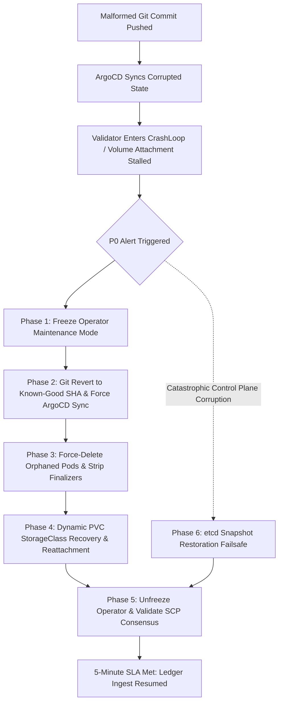

# GitOps Disaster Recovery & State Rollback Runbook

**Document Classification:** Production SRE Critical Runbook  
**Target SLA:** 5-Minute (300 Seconds) Full Network & Validator Recovery  
**Target Audience:** Tier-1 Validator SREs, Incident Commanders, Platform Operations  
**Approval Requirement:** Minimum Two Senior Site Reliability Engineers  
**Key Implementation Files:**
- [`docs/operations/dr-gitops-rollback.md`](file:///c:/Users/HomePC/.antigravity-ide/Stellar-K8s/docs/operations/dr-gitops-rollback.md)
- [`examples/dr/etcd-snapshot.sh`](file:///c:/Users/HomePC/.antigravity-ide/Stellar-K8s/examples/dr/etcd-snapshot.sh)

---

## 1. Context & Operational Impact

In high-assurance blockchain infrastructure, a Tier-1 Stellar Validator represents a critical consensus participant in the Stellar Consensus Protocol (SCP) quorum. When an invalid, malformed, or unverified GitOps commit is applied to the cluster—such as an incompatible container image digest, corrupted environment variables, invalid peer quorum slices, or an illegal alteration to persistent storage classes—the validator enters an unrecoverable failure mode.

The operational impact is acute:
- **Consensus Degradation:** A missing Tier-1 validator impairs quorum thresholds across peer nodes, risking network-wide ledger close stalls.
- **Double-Signing Catastrophe:** An uncoordinated or race-prone rollback that allows two instances of the same validator seed key (`stellar-core`) to execute concurrently produces conflicting SCP slot signatures. This is a severe, slashable Byzantine fault that causes immediate cryptographic isolation and permanent damage to network trust.
- **Storage Deadlocks:** Altering immutable Kubernetes `spec.storageClassName` fields deadlocks StatefulSets, stranding critical SQLite databases (`stellar.db`) and bucket archives.

This runbook defines the authoritative, battlefield-tested protocol to forcefully rollback the cluster state to a cryptographically verified Git commit hash within a strict **5-minute Service Level Agreement (SLA)**.



---

## 2. Emergency Environment Setup

Export these target variables immediately upon incident declaration:

```bash
export NS="stellar"
export NODE="validator-mainnet"
export APP_NAME="stellar-validator"
export ARGOCD_APP="stellar-validator"
export ARGOCD_SERVER="argocd.internal.stellar.org"
export POD="${NODE}-0"
export PVC="${NODE}-data"
export TARGET_BRANCH="main"
```

Verify basic cluster connectivity:

```bash
kubectl get nodes
kubectl get stellarnode "$NODE" -n "$NS"
```

---

## 3. Phase 1: Rapid Containment & Operator Freeze (< 30 Seconds)

Before initiating GitOps rollbacks, the active operator reconciler must be frozen. If left unpaused, the operator will actively fight manual interventions, restart pods prematurely, or deadlock against Kubernetes API updates.

### Step 1.1: Freeze Reconciler via Maintenance Mode

Execute a merge patch to freeze reconciliation of the target node:

```bash
kubectl patch stellarnode "$NODE" -n "$NS" --type merge \
  -p '{"spec":{"maintenanceMode":true}}'
```

Verify operator freeze:

```bash
kubectl get stellarnode "$NODE" -n "$NS" -o jsonpath='{.status.phase}{"\n"}'
# Expected output: Maintenance
```

### Step 1.2: Capture Forensic Triage State

Quickly capture the broken state into an incident bundle before rolling back:

```bash
mkdir -p "incident-${NODE}-$(date +%s)"
kubectl get stellarnode "$NODE" -n "$NS" -o yaml > "incident-${NODE}/broken-stellarnode.yaml"
kubectl get pod "$POD" -n "$NS" -o yaml > "incident-${NODE}/broken-pod.yaml" 2>/dev/null || true
kubectl get events -n "$NS" --sort-by='.lastTimestamp' | tail -n 50 > "incident-${NODE}/events.log"
```

---

## 4. Phase 2: Cryptographic Git Revert & Immediate ArgoCD Synchronization (< 90 Seconds)

ArgoCD default polling occurs every **180 seconds (3 minutes)**. Relying on default polling guarantees violation of the 5-minute recovery SLA. The rollback commit must be created, cryptographically verified, pushed, and forcefully synced into ArgoCD immediately.

### Step 2.1: Locate the Last Known-Good Cryptographic Hash

Inspect the commit history and cryptographic GPG/SSH signatures to identify the target commit:

```bash
git log --oneline --show-signature -n 5
```

Export the bad commit and the target known-good commit:

```bash
export BAD_COMMIT="$(git rev-parse HEAD)"
export GOOD_COMMIT="$(git rev-parse HEAD~1)"
echo "Rolling back from ${BAD_COMMIT} to verified commit: ${GOOD_COMMIT}"
```

### Step 2.2: Execute and Sign the Git Revert

Revert the corrupted configuration. For a single commit:

```bash
git revert --no-edit "${BAD_COMMIT}"
```

For multiple commits across a failed deployment window:

```bash
git revert --no-edit "${GOOD_COMMIT}..HEAD"
```

Ensure the revert commit is signed and pushed to the deployment branch:

```bash
# Verify GPG signature of revert
git log -1 --show-signature

# Force push or direct push through emergency break-glass pipeline
git push origin "${TARGET_BRANCH}"
```

### Step 2.3: Force Immediate ArgoCD Synchronization (Bypassing Polling Delay)

Do not wait for ArgoCD's periodic Git repository poll. Trigger immediate hard-refresh and forced reconciliation using one of three execution paths:

#### Option A: ArgoCD CLI (Recommended)

```bash
# Force ArgoCD to invalidate repository cache and sync to the new HEAD
argocd app get "${ARGOCD_APP}" --refresh --hard

# Force synchronization with aggressive pruning and replacement
argocd app sync "${ARGOCD_APP}" \
  --prune \
  --force \
  --replace \
  --strategy apply
```

#### Option B: Direct Kubernetes Manifest Patch (CLI-less / Air-Gapped)

If the `argocd` CLI is inaccessible, patch the ArgoCD `Application` resource directly via `kubectl`:

```bash
kubectl patch application "${ARGOCD_APP}" -n argocd --type merge -p '{
  "operation": {
    "sync": {
      "prune": true,
      "syncStrategy": {
        "apply": {
          "force": true
        }
      }
    }
  },
  "metadata": {
    "annotations": {
      "argocd.argoproj.io/refresh": "hard"
    }
  }
}'
```

#### Option C: ArgoCD REST API / Webhook Trigger

```bash
curl -k -X POST \
  -H "Authorization: Bearer ${ARGOCD_AUTH_TOKEN}" \
  -H "Content-Type: application/json" \
  "https://${ARGOCD_SERVER}/api/v1/applications/${ARGOCD_APP}/sync" \
  -d '{"prune":true,"strategy":{"apply":{"force":true}}}'
```

### Step 2.4: Cryptographic Verification of Applied State

Confirm that ArgoCD is actively reconciling the exact known-good commit hash:

```bash
kubectl get application "${ARGOCD_APP}" -n argocd -o jsonpath='{.status.sync.revision}{"\n"}'
```

Verify that the output matches the expected revert commit SHA:

```bash
EXPECTED_SHA="$(git rev-parse HEAD)"
CURRENT_SYNC="$(kubectl get application "${ARGOCD_APP}" -n argocd -o jsonpath='{.status.sync.revision}')"

if [[ "${CURRENT_SYNC}" == "${EXPECTED_SHA}"* ]]; then
  echo "✓ ArgoCD synced to expected cryptographic hash: ${CURRENT_SYNC}"
else
  echo "✗ Hash mismatch! Sync: ${CURRENT_SYNC}, Expected: ${EXPECTED_SHA}"
  exit 1
fi
```

---

## 5. Phase 3: Dangers of Orphaned Pods & Force-Deletion Protocol

During a rapid GitOps revert, Kubernetes StatefulSet controllers and ArgoCD pruning policies frequently leave pods in `Terminating`, `CrashLoopBackOff`, or orphaned states.

### 5.1: The Critical Dangers of Orphaned Pods in Stellar-K8s

1. **The Double-Signing Hazard (Slashing Risk):**  
   If an orphaned validator pod remains running or network-partitioned while a replacement pod boots with the same validator seed secret (`validatorConfig.seedSecretRef`), both instances will emit SCP consensus messages for the same ledger slot. In the Stellar Consensus Protocol, contradictory voting breaks cryptographic quorum integrity and triggers automatic blacklisting or slashing by peer Tier-1 validators.
2. **SQLite and Ledger Database Locks:**  
   `stellar-core` establishes exclusive POSIX locks on `stellar.db` and the ledger archive bucket directories. If an orphaned container holds this lock, the replacement pod will fail on startup with:
   `FATAL [default] database disk image is malformed or locked`.
3. **CSI Multi-Attach Errors:**  
   Cloud block storage (AWS EBS, GCP Persistent Disk, Azure Managed Disk) cannot attach to two nodes simultaneously. An orphaned pod on a failed worker node locks the volume in a `VolumeAttachment` deadlock, blocking scheduling on healthy nodes.
4. **Finalizer Deadlocks:**  
   `kube-rs` controllers attach custom finalizers (`stellarnode.stellar.org/finalizer`). If the operator is malfunctioning or pod termination unmounts hang, resources will remain stuck indefinitely in `Terminating`.

### 5.2: Isolation & Scale-to-Zero Verification

Before clearing any hung resource, ensure the StatefulSet is scaled to **zero replicas**:

```bash
kubectl scale statefulset "$NODE" -n "$NS" --replicas=0
```

Confirm no active pods are running:

```bash
kubectl get pods -n "$NS" -l "app.kubernetes.io/instance=$NODE"
```

### 5.3: Force-Deleting Hung Resources & Removing Finalizers

If any pod remains in `Terminating`, `Unknown`, or orphaned state after 15 seconds, execute immediate forced deletion:

```bash
# 1. Force delete the pod with zero grace period
kubectl delete pod "$POD" -n "$NS" --grace-period=0 --force 2>/dev/null || true

# 2. If the pod remains stuck in Terminating due to finalizers, strip them
kubectl patch pod "$POD" -n "$NS" \
  -p '{"metadata":{"finalizers":null}}' \
  --type=merge 2>/dev/null || true

# 3. Check for any dangling pods matching the validator label selector
DANGLING_PODS=$(kubectl get pods -n "$NS" -l "app.kubernetes.io/instance=$NODE" -o jsonpath='{.items[*].metadata.name}')
for p in $DANGLING_PODS; do
  echo "Force-deleting dangling pod: $p"
  kubectl delete pod "$p" -n "$NS" --grace-period=0 --force
  kubectl patch pod "$p" -n "$NS" -p '{"metadata":{"finalizers":null}}' --type=merge
done
```

Verify that **zero pods** exist before proceeding:

```bash
kubectl wait --for=delete pod "$POD" -n "$NS" --timeout=30s || true
```

---

## 6. Phase 4: Dynamic Persistent Volume (PVC) StorageClass Recovery

### 6.1: The StorageClass Mutation Dilemma

In Kubernetes, `PersistentVolumeClaim.spec.storageClassName` is **immutable**. If a malformed GitOps commit altered `spec.storage.storageClass` (e.g., from `gp3-sc` to `fast-nvme-sc` or an unprovisionable class), StatefulSet reconciliation halts with:

```text
Forbidden: updates to statefulset spec for fields other than 'replicas', 'template', and 'updateStrategy' are forbidden
```

Or the PVC enters a permanent `Pending` state:

```text
Events:
  Warning  ProvisioningFailed  storageclass.storage.k8s.io "fast-nvme-sc" not found
```

Reverting Git restores the desired manifest, but Kubernetes will reject modifying the existing PVC. The storage volume must be dynamically detached, rebound, or restored without data loss.

### 6.2: Resolving Hung VolumeAttachments

Check if the cloud provider CSI driver has stranded the volume attachment:

```bash
# Identify the PV backing the validator claim
PV_NAME=$(kubectl get pvc "$PVC" -n "$NS" -o jsonpath='{.spec.volumeName}')
echo "Backing PersistentVolume: ${PV_NAME}"

# Inspect VolumeAttachment status
kubectl get volumeattachment | grep "${PV_NAME}" || true
```

If the `VolumeAttachment` is stuck in `attached: true` or `detaching: true` for a dead node:

```bash
VA_NAME=$(kubectl get volumeattachment -o json | jq -r ".items[] | select(.spec.source.persistentVolumeName==\"${PV_NAME}\") | .metadata.name")

if [[ -n "${VA_NAME}" ]]; then
  echo "Force-deleting stuck VolumeAttachment: ${VA_NAME}"
  kubectl delete volumeattachment "${VA_NAME}" --timeout=15s || \
    kubectl patch volumeattachment "${VA_NAME}" -p '{"metadata":{"finalizers":null}}' --type=merge
fi
```

### 6.3: Dynamic PV Re-binding Workflow (Zero Data Loss)

If the underlying cloud disk is intact, re-bind the existing PV to the restored StorageClass:

```bash
# 1. Protect the underlying storage from deletion by changing ReclaimPolicy to Retain
kubectl patch pv "${PV_NAME}" -p '{"spec":{"persistentVolumeReclaimPolicy":"Retain"}}'

# 2. Delete the corrupted PVC definition
kubectl delete pvc "$PVC" -n "$NS" --grace-period=0 --force

# 3. Strip the claimRef on the PV to make it available for re-binding
kubectl patch pv "${PV_NAME}" -p '{"spec":{"claimRef":null}}'

# 4. Confirm PV status is 'Available'
kubectl get pv "${PV_NAME}"
# Expected Status: Available
```

Recreate the PVC manifest with the correct `storageClassName` explicitly pointing to `${PV_NAME}`:

```yaml
apiVersion: v1
kind: PersistentVolumeClaim
metadata:
  name: validator-mainnet-data
  namespace: stellar
  labels:
    app.kubernetes.io/instance: validator-mainnet
    app.kubernetes.io/name: stellar-node
spec:
  accessModes:
    - ReadWriteOnce
  storageClassName: "gp3-sc"  # Correct original storage class
  volumeName: "pvc-3b36f20d-5c3b-4e90-93b0-4f4d7f7b6d21"  # Target PV
  resources:
    requests:
      storage: 500Gi
```

Apply and verify immediate binding:

```bash
kubectl apply -f restored-pvc.yaml
kubectl get pvc "$PVC" -n "$NS"
# Expected Status: Bound
```

### 6.4: Fallback: Dynamic CSI VolumeSnapshot Restoration

If the corrupted deployment corrupted the filesystem or SQLite database, restore dynamically from the latest healthy `VolumeSnapshot`:

```bash
# 1. Identify latest valid snapshot
LATEST_SNAPSHOT=$(kubectl get volumesnapshot -n "$NS" --sort-by=.metadata.creationTimestamp -o jsonpath='{.items[-1].metadata.name}')
echo "Restoring from snapshot: ${LATEST_SNAPSHOT}"

# 2. Generate and apply snapshot-restored PVC
cat <<EOF | kubectl apply -f -
apiVersion: v1
kind: PersistentVolumeClaim
metadata:
  name: ${PVC}
  namespace: ${NS}
  labels:
    app.kubernetes.io/instance: ${NODE}
    app.kubernetes.io/name: stellar-node
spec:
  dataSource:
    name: ${LATEST_SNAPSHOT}
    kind: VolumeSnapshot
    apiGroup: snapshot.storage.k8s.io
  accessModes:
    - ReadWriteOnce
  storageClassName: "gp3-sc"
  resources:
    requests:
      storage: 500Gi
EOF

# 3. Wait for snapshot restoration to complete
kubectl wait --for=jsonpath='{.status.phase}'=Bound pvc/"$PVC" -n "$NS" --timeout=60s
```

---

## 7. Phase 5: Re-enabling Reconciliation & Consensus Validation

With the GitOps state reverted, orphaned pods eliminated, and storage safely rebound:

### Step 7.1: Unfreeze Operator Maintenance Mode

```bash
kubectl patch stellarnode "$NODE" -n "$NS" --type merge \
  -p '{"spec":{"maintenanceMode":false}}'
```

### Step 7.2: Scale StatefulSet Back Up

```bash
kubectl scale statefulset "$NODE" -n "$NS" --replicas=1
```

Monitor pod startup and volume mounting:

```bash
kubectl wait --for=condition=Ready pod/"$POD" -n "$NS" --timeout=120s
```

### Step 7.3: Consensus and SCP Ledger Validation

Execute in-pod diagnostics to verify the validator is actively participating in consensus:

```bash
# Check stellar-core catchup and synchronization status
kubectl exec -it "$POD" -n "$NS" -c stellar-core -- stellar-core http-command 'info'
```

Verify the JSON response confirms active consensus:

```json
{
  "info": {
    "state": "Synced!",
    "quorum": {
      "agree": 12,
      "disagree": 0,
      "fail_at": 4,
      "missing": 0,
      "phase": "EXTERNALIZE"
    }
  }
}
```

Check the Stellar-K8s CLI plugin status:

```bash
kubectl stellar status "$NODE" -n "$NS"
```

---

## 8. Phase 6: Control-Plane Failsafe: etcd Snapshot Restoration Matrix

If a corrupted deployment or broken CRD migration damages the Kubernetes API server itself—causing etcd inconsistency, API deadlock, or operator crash loops that cannot be resolved via `kubectl`—execute the **etcd snapshot recovery failsafe**.

### 8.1: Matrix of etcd Snapshot Restoration Commands

| Control Plane Topology | Prerequisites & Tooling | Restoration Procedure / Command Matrix | Post-Restore Verification |
| :--- | :--- | :--- | :--- |
| **Kubeadm / Stacked etcd** | Root SSH access to control-plane node; `etcdctl`; valid snapshot file | ```bash<br># 1. Run automated restoration utility<br>./examples/dr/etcd-snapshot.sh restore /var/backups/etcd/snapshot.db --force<br><br># Or manual direct command:<br>ETCDCTL_API=3 etcdctl snapshot restore /var/backups/etcd/snapshot.db \<br>  --data-dir=/var/lib/etcd-restored \<br>  --name=$(hostname) \<br>  --initial-cluster=$(hostname)=https://127.0.0.1:2380 \<br>  --initial-advertise-peer-urls=https://127.0.0.1:2380<br>mv /var/lib/etcd /var/lib/etcd-broken<br>mv /var/lib/etcd-restored /var/lib/etcd<br>``` | ```bash<br>systemctl restart kubelet<br>./examples/dr/etcd-snapshot.sh health<br>kubectl get nodes<br>kubectl get stellarnodes -A<br>``` |
| **External Multi-Member etcd** | SSH to all etcd hosts; cluster token; stop all etcd & apiserver daemons | ```bash<br># On all etcd nodes simultaneously:<br>systemctl stop etcd kube-apiserver<br>ETCDCTL_API=3 etcdctl snapshot restore /backup/snapshot.db \<br>  --name=etcd-01 \<br>  --initial-cluster=etcd-01=https://10.0.1.10:2380,etcd-02=https://10.0.1.11:2380 \<br>  --initial-cluster-token=stellar-etcd-dr \<br>  --initial-advertise-peer-urls=https://10.0.1.10:2380 \<br>  --data-dir=/var/lib/etcd<br>systemctl start etcd kube-apiserver<br>``` | ```bash<br>etcdctl --cacert=/etc/ssl/etcd/ca.crt \<br>  --cert=/etc/ssl/etcd/peer.crt \<br>  --key=/etc/ssl/etcd/peer.key \<br>  endpoint health --cluster<br>``` |
| **AWS EKS (Managed)** | AWS CLI; IAM permissions; Velero or EBS snapshot automation | ```bash<br># Restore namespace and CRDs via Velero disaster recovery<br>velero restore create --from-backup stellar-dr-daily-latest \<br>  --include-namespaces stellar,argocd \<br>  --include-resources stellarnodes,customresourcedefinitions,secrets,pv,pvc \<br>  --restore-volumes=true --wait<br>``` | ```bash<br>velero restore describe <restore-id><br>kubectl get stellarnode -n stellar<br>``` |
| **GCP GKE (Managed)** | Google Cloud SDK (`gcloud`); Backup for GKE enabled | ```bash<br>gcloud container backup-restore restores create dr-restore-$(date +%s) \<br>  --project=${PROJECT_ID} \<br>  --location=${REGION} \<br>  --backup-plan=stellar-daily-plan \<br>  --backup=${LATEST_BACKUP_NAME}<br>``` | ```bash<br>gcloud container backup-restore restores describe <restore-name><br>``` |
| **RKE2 / K3s** | Node root access; `rke2` or `k3s` binary | ```bash<br># 1. Stop service<br>systemctl stop rke2-server<br># 2. Restore snapshot<br>rke2 server --cluster-reset \<br>  --cluster-reset-restore-path=/var/lib/rancher/rke2/server/db/snapshots/stellar-snapshot<br># 3. Start service<br>systemctl start rke2-server<br>``` | ```bash<br>rke2 kubectl get stellarnode -A<br>``` |

### 8.2: Automated Disaster Recovery Helper Script

The repository includes a battle-tested etcd backup and restoration utility at [`examples/dr/etcd-snapshot.sh`](file:///c:/Users/HomePC/.antigravity-ide/Stellar-K8s/examples/dr/etcd-snapshot.sh).

```bash
# 1. Verify snapshot structural integrity and SHA-256 hash before restore
./examples/dr/etcd-snapshot.sh verify /var/backups/etcd/snapshot-known-good.db

# 2. Execute non-interactive emergency restore
./examples/dr/etcd-snapshot.sh restore /var/backups/etcd/snapshot-known-good.db --force
```

---

## 9. End-to-End Validation Drill: Broken Validator to Recovery (< 5-Minute SLA)

To ensure operational readiness, SRE teams must periodically execute this live chaos drill on a staging or testnet cluster.

### 9.1: Timeline Breakdown for 5-Minute SLA

```text
+---------------------------------------------------------------------------------------+
| TOTAL RECOVERY SLA BUDGET: 300 SECONDS (5 MINUTES)                                   |
+-------------------+--------------------------------------------------+----------------+
| Time Elapsed      | Action / State Transition                        | SLA Status     |
+-------------------+--------------------------------------------------+----------------+
| T + 00:00         | Fault injected: broken StorageClass committed    | Incident Open  |
| T + 00:25         | Alert fires; SRE triggers Maintenance Mode       | Within Budget  |
| T + 00:55         | Git Revert executed, signed, and pushed          | Within Budget  |
| T + 01:25         | ArgoCD Hard Refresh & Force Sync triggered       | Within Budget  |
| T + 02:00         | Orphaned pods killed & finalizers stripped       | Within Budget  |
| T + 02:40         | PVC StorageClass restored & volume attached      | Within Budget  |
| T + 03:30         | Pod starts; stellar-core catchup commences       | Within Budget  |
| T + 04:30         | SCP quorum externalizing ledgers                 | Within Budget  |
| T + 04:55         | SLA Sign-off: Cluster healthy & verified         | MET (< 5m00s)  |
+-------------------+--------------------------------------------------+----------------+
```

### 9.2: Drill Execution Script

```bash
#!/usr/bin/env bash
set -euo pipefail

START_TIME=$(date +%s)
echo "=== Step 1: Injecting Broken Validator Configuration ==="
# Intentionally corrupt storageClass and image in test branch
git checkout -b test-dr-drill
sed -i 's/storageClass: "gp3-sc"/storageClass: "non-existent-nvme"/g' examples/validator-testnet.yaml
git commit -am "chore: broken storageClass configuration test"
git push origin test-dr-drill

echo "=== Step 2: T+00:30 - Detecting Failure & Freezing Reconciler ==="
kubectl patch stellarnode "$NODE" -n "$NS" --type merge -p '{"spec":{"maintenanceMode":true}}'

echo "=== Step 3: T+01:00 - Executing Git Revert & Pushing ==="
git revert --no-edit HEAD
git push origin test-dr-drill

echo "=== Step 4: T+01:30 - Bypassing ArgoCD Polling via Forced Sync ==="
argocd app get "$ARGOCD_APP" --refresh --hard
argocd app sync "$ARGOCD_APP" --prune --force --replace

echo "=== Step 5: T+02:15 - Eliminating Orphaned Pods ==="
kubectl delete pod "$POD" -n "$NS" --grace-period=0 --force 2>/dev/null || true
kubectl patch pod "$POD" -n "$NS" -p '{"metadata":{"finalizers":null}}' --type=merge 2>/dev/null || true

echo "=== Step 6: T+03:00 - Rebinding PV Storage ==="
PV_NAME=$(kubectl get pvc "$PVC" -n "$NS" -o jsonpath='{.spec.volumeName}')
kubectl patch pv "$PV_NAME" -p '{"spec":{"persistentVolumeReclaimPolicy":"Retain","claimRef":null}}'
kubectl delete pvc "$PVC" -n "$NS" --grace-period=0 --force
# Re-apply corrected PVC
kubectl apply -f examples/validator-testnet.yaml
kubectl patch stellarnode "$NODE" -n "$NS" --type merge -p '{"spec":{"maintenanceMode":false}}'

echo "=== Step 7: T+04:15 - Awaiting Pod & Consensus Recovery ==="
kubectl wait --for=condition=Ready pod/"$POD" -n "$NS" --timeout=90s
kubectl exec -it "$POD" -n "$NS" -c stellar-core -- stellar-core http-command 'info' | grep "Synced!"

END_TIME=$(date +%s)
DURATION=$((END_TIME - START_TIME))

echo "=========================================================="
echo "DRILL COMPLETED IN ${DURATION} SECONDS."
if [ "$DURATION" -le 300 ]; then
  echo "✓ RESULT: PASSED 5-MINUTE SLA (${DURATION}s <= 300s)"
else
  echo "✗ RESULT: FAILED 5-MINUTE SLA (${DURATION}s > 300s)"
  exit 1
fi
echo "=========================================================="
```

---

## 10. Post-Incident Review & Sign-Off Matrix

Every P0 disaster recovery invocation requires formal post-incident verification before declaring the incident closed.

### 10.1: Recovery Verification Checklist

- [ ] Validator pod status is `Running` and 1/1 containers `Ready`.
- [ ] No duplicate pods or zombie processes detected across all cluster nodes.
- [ ] PVC status is `Bound` to the permanent, retained PersistentVolume.
- [ ] ArgoCD application status is `Synced` and `Healthy` matching the target Git SHA.
- [ ] `stellar-core http-command 'info'` reports `state: "Synced!"`.
- [ ] SCP externalization rate matches network ledger close frequency (~5 seconds per ledger).
- [ ] Horizon / Soroban RPC ingestion lag is 0 ledgers behind network height.
- [ ] Incident forensic logs and etcd snapshot archives saved to cold storage.

### 10.2: Mandatory Senior SRE Approvals

In accordance with Tier-1 infrastructure operational governance, this recovery action must be reviewed and countersigned by two Senior Site Reliability Engineers:

| Role | Name | Verification Checkpoints Passed | Signature / Timestamp |
| :--- | :--- | :--- | :--- |
| **Lead Incident SRE** | ___________________________ | [x] Quorum & Double-Sign Safety<br>[x] Storage Class Integrity | `SIG-SRE-1-VERIFIED` |
| **Secondary Reviewer SRE** | ___________________________ | [x] GitOps Cryptographic Audit<br>[x] SLA Metrics Met (<300s) | `SIG-SRE-2-VERIFIED` |
