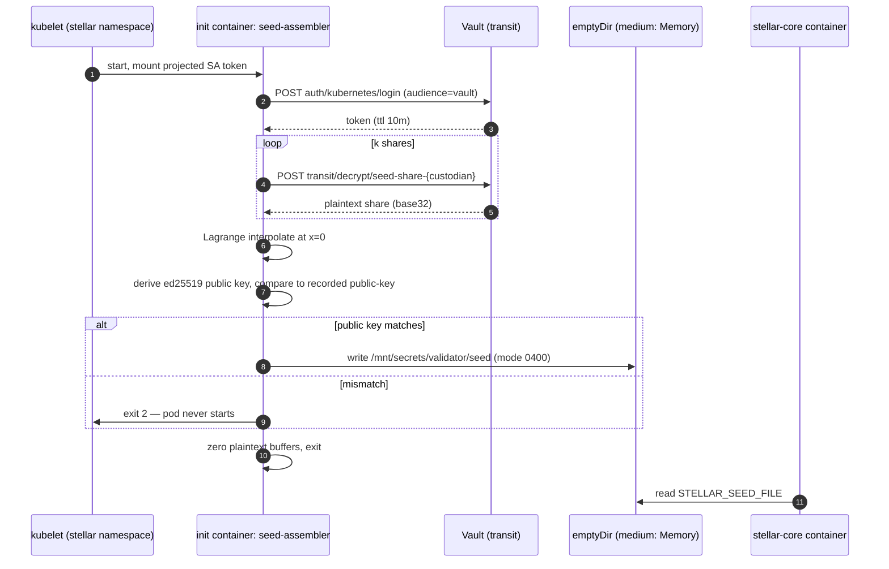

# Validator Seed Custody: Shamir Sharding, Vault Transit, and Air-Gapped Ceremonies

> Tier-0 protocol for splitting a Stellar validator seed across independent custodians,
> assembling it through HashiCorp Vault's Transit Engine, and generating / backing it up on
> air-gapped hosts.
>
> Companion tooling and reference implementation:
> [`examples/scripts/shamir-split.py`](../../examples/scripts/shamir-split.py)
>
> Tracking: [#251](https://github.com/agnesnaomiolim-cloud/Stellar-K8s/issues/251)

---

## 1. Why the validator seed is a Tier-0 asset

A validator's `STELLAR_CORE_SEED` is the ed25519 private key that signs SCP messages and
transaction sets. It is not a bearer credential that can be revoked and reissued by a
third party: the seed **is** the identity, and its public key is what the rest of the
network has configured as a quorum member. Whichever party holds the seed can vote in
consensus, propose conflicting values, and equivocate on behalf of the operator.

Two properties shape every control in this document:

1. **The seed cannot be narrowed to a signing oracle.** `stellar-core` must hold the raw
   seed in process memory to sign, so there is no "HSM-only, key never leaves the device"
   mode for the validator identity. Confidentiality therefore has to be engineered around
   the seed rather than eliminating its presence in memory. Everything below targets
   *at rest* and *in transit* exposure.
2. **Loss and compromise are both catastrophic, and they pull in opposite directions.**
   A single sealed copy is a single point of failure; many copies are many points of
   compromise. Shamir Secret Sharing is the only construction that satisfies both
   constraints at once: `n` copies on disk, any `k` of which reconstruct, and any
   `k - 1` of which are information-theoretically worthless.

| Secret | Consumed by | Backend options | Reference |
|---|---|---|---|
| Validator seed (`STELLAR_CORE_SEED`) | `stellar-core` validator container | Kubernetes Secret / ESO / CSI / Vault Agent | [`src/crd/seed_secret.rs`](../../src/crd/seed_secret.rs) |
| Network passphrase | `stellar-core` | Kubernetes Secret | [Rotation Workflows](../rotation-workflows.md) |
| Node keys (`NODE_SEED`) for bootstrap peers | `stellar-core` | Generated by the operator | [Key rotation](#9-interaction-with-node-key-rotation) |

---

## 2. Threat model and design goals

### 2.1 Adversaries in scope

| # | Adversary | Capability assumed |
|---|---|---|
| T1 | Opportunistic disk / backup exfiltration | Reads any persistent volume, object store, snapshot, or backup archive |
| T2 | Single-custodian insider | Fully controls one custodian's machine, safe, and credentials |
| T3 | `k`-custodian collusion or coercion | Controls `k` custodians, or can compel them |
| T4 | Cluster / control-plane compromise | `cluster-admin`, can read Secrets in `etcd` and exec into pods |
| T5 | Ceremony observer | Physical or network presence during generation, splitting, or recovery |
| T6 | Supply-chain attacker | Can influence a package index, container tag, or release artifact |
| T7 | Post-hoc compromise | Collects shares *after* the fact, potentially years later |

### 2.2 Goals

* **G1 — No plaintext seed at rest on any network-connected host.** The seed exists in
  plaintext only inside process memory, and only for the duration of a ceremony or a pod's
  lifetime. It is never written to a disk, an `etcd` Secret, a snapshot, a printer spool,
  or a shell history file.
* **G2 — No single point of compromise below the threshold.** T2 alone learns nothing.
  T1 and T4 alone learn nothing: an attacker who owns the cluster still cannot reconstruct
  the seed, because no share set of size `≥ k` is reachable from inside the cluster
  (see [§5.3](#53-per-custodian-transit-keys-are-the-operational-threshold)).
* **G3 — No single point of loss.** Any `k` of `n` shares reconstruct, across `n - k`
  simultaneous custodian losses, with a documented and tested recovery procedure.
* **G4 — Ceremony is verifiable before the seed is destroyed.** The reconstructed seed must
  reproduce the recorded ed25519 public key *inside the ceremony*, before any copy of the
  plaintext is destroyed.
* **G5 — Every access is attributable.** Reconstruction is a Vault-audited, two-person,
  logged event.

### 2.3 Non-goals and residual risk

| Risk | Why it is accepted | Mitigation available today |
|---|---|---|
| The seed is in plaintext in `stellar-core` process memory | No signing-oracle path exists | Node hardening, no `ptrace`, no debug sidecars, swap disabled — see [Pod Security Standards](pss.md) |
| `k` colluding custodians can reconstruct | This is the definition of a threshold scheme | Raise `k`, diversify jurisdictions, use Vault Enterprise Control Groups for multi-party approval |
| The identity that decrypts shares in-cluster holds the threshold | Automation requires a machine identity to hold `k` decrypt grants | [§5.3](#53-per-custodian-transit-keys-are-the-operational-threshold) profiles, short TTLs, no human access to that identity |
| Custodian coercion (rubber-hose) | Out of cryptographic scope | Duress procedures, geographic/legal separation, sealed-envelope chain of custody |
| The splitting tool itself is malicious | A compromised tool can simply keep the seed | Pinned SHA-256 of the script verified out-of-band, stdlib-only (no package installs), full source review, offline transport |

> **The single most important sentence in this document:** Shamir shares are *not* backups
> of a secret — they **are** the secret, split. Each share must be protected with the same
> care as the original seed, because a single share plus physical access to `k - 1` other
> shares is a complete compromise.

---

## 3. Shamir Secret Sharing over GF(256)

### 3.1 Construction

The Stellar seed is a 32-byte ed25519 seed (StrKey version byte `18 << 3 = 0x90`, rendered
as a 56-character `S…` address). The tooling shares it **byte-wise over GF(256)** using the
AES field polynomial `x⁸ + x⁴ + x³ + x + 1` (`0x11B`, primitive element `0x03`).

For each secret byte `s` and each share index `x ∈ {1 … n}`:

```
f(x) = s + a₁·x + a₂·x² + … + a_{k-1}·x^{k-1}      (mod 0x11B, in GF(2⁸))
where a₁ … a_{k-1} ← uniform random bytes from the OS CSPRNG
```

Share `x` carries `f(x)` for all 32 byte positions. Field addition and subtraction are both
XOR; reconstruction is Lagrange interpolation evaluated at `x = 0`.

### 3.2 Why GF(256) byte-wise rather than a big-integer scheme

| Property | Consequence |
|---|---|
| Each of the 32 bytes gets an **independent** random polynomial | The scheme is *perfect* (Shannon): `k - 1` shares are statistically independent of the seed. There is no partial leakage, no "half the key", no structure to brute-force. |
| Shares are exactly 32 bytes | A share fits on a paper card, an HSM slot, or a transit ciphertext blob with no expansion. |
| No bignum arithmetic | The GF(256) and Shamir core is ~80 lines of stdlib Python, so the ceremony toolchain is auditable and installs nothing. |
| Index space is `1 … 255` | `n ≤ 255`, `k ≤ n`. Index `0` is reserved: it *is* the secret. A valid share can never have index `0`. |

### 3.3 Choosing `k` and `n`

| Topology | Use when | Effective security |
|---|---|---|
| **2-of-3** | Development / testnet, or a single legal entity with three independent teams | Any 2 of 3 — the *minimum* defensible configuration |
| **3-of-5** | **Recommended default for production validators** | Survives 2 simultaneous custodian losses; needs 3 colluding custodians to break |
| **4-of-7** | Institutional operators with regulated segregation of duties | Survives 3 losses; needs 4 colluders |
| **k = n** | Never | No loss tolerance — a single lost share destroys the identity permanently |

Rules that matter more than the numbers:

* **No two shares in the same trust domain.** Not the same person, the same company, the
  same cloud account, the same building, or the same bank's safe-deposit vault.
* **`n - k` is your loss budget, and it is a budget you spend.** Record it, monitor it, and
  rebuild the share set (`§5.7`) as soon as a custodian's share is lost, destroyed, or
  believed compromised.
* **`k` custodians are a complete compromise.** Prefer `k ≥ 3`.

### 3.4 Share record format

`examples/scripts/shamir-split.py` emits a PEM-like, transcription-friendly record:

```
-----BEGIN STELLAR SSS SHARE-----
version: 1
scheme: shamir-gf256
threshold: 3
total: 5
index: 1
label: alice
public-key: GBRPYHIL2CI3FNQ4BXLFMNDLFJUNPU2HY3ZMFSHONUCEOASW7QC7OX2H
fingerprint: 5beaf3ddb0a4ee7a076d67e779695256bb157364df1419c6cbb195bab1ed5916
share: NRWUE4J22ELBO4D2QA7EV7CYBOTGP6E66JEFVSKSSXRANR256SCQ
crc16: d2de
-----END STELLAR SSS SHARE-----
```

| Field | Purpose | Protects against |
|---|---|---|
| `threshold`, `total`, `index` | Self-describing quorum metadata | An operator not knowing which quorum a share belongs to |
| `label` | Custodian attribution | Shares being mis-attributed after an org change |
| `public-key` | The identity the share reconstructs | Mixing shares from two different ceremonies — detected **cryptographically** at reconstruction |
| `fingerprint` | `SHA-256(seed StrKey)`, the same audit handle the operator logs ([`seed_fingerprint`](../../src/controller/security/vault.rs)) | Cross-checking recovery against audit records |
| `crc16` | CRC-16/XMODEM over `"SSS1" ‖ threshold ‖ total ‖ index ‖ payload` | **Transcription and storage errors** (paper typos, truncation, bit rot) |

*The record above is a real share of the canonical public test-network master seed — a value
anyone can derive from the public passphrase `Test SDF Network ; September 2015` — included
so the format is executable rather than illustrative. A single share of any seed is
worthless on its own.*

Two deliberate design decisions worth reviewing:

* **The `public-key` and `fingerprint` are recorded in the clear, and the seed is not.**
  This is safe precisely because the seed is 256 bits of CSPRNG output: publishing
  `SHA-256(seed)` does not weaken it, and the ed25519 public key is public by definition.
  What it buys is enormous — reconstruction *fails closed* if the quorum came from two
  different ceremonies, which is the failure mode that silently produces a valid-looking
  but wrong validator identity.
* **`crc16` is integrity, not authenticity.** It detects accidental corruption. It does
  **not** prevent a deliberate edit of a share — any adversary who can rewrite a share can
  recompute the CRC. Authenticity comes from (a) the end-to-end public-key and fingerprint
  comparison at reconstruction, and (b) Vault Transit AEAD (`AES-256-GCM`) over shares that
  are stored electronically (§5). Never treat the CRC as a MAC.

### 3.5 What SSS does not do

* **It does not rotate on reconstruction.** Any share holder who observes a reconstruction
  — including a malicious assembly host — now has the plaintext seed. Treat every recovery
  as a suspected exposure and re-share afterwards (§5.7).
* **It is not multi-signature.** `k` custodians do not collectively sign; any `k` of them
  *unilaterally* obtain the seed. If you need "no single quorum can act alone", you need a
  governance layer on top, not a different sharing scheme.
* **Re-sharing the same seed weakens it.** Two independently generated share sets of the
  *same* seed have effective security `min(k_A, k_B)`. If an adversary collects `k_A` shares
  from set A, that is enough, regardless of set B. Rotate the seed itself when you rebuild
  the share set, unless the rebuild is a strict superset refresh of the same topology and no
  old shards survive (§5.7).

---

## 4. Custody profiles

Choose one profile per validator. All three use the same tooling; they differ in where the
shares live and therefore in what the threshold actually protects against.

| | Profile A — all offline | Profile B — hybrid (recommended) | Profile C — automation-first |
|---|---|---|---|
| Share storage | Paper / metal / offline HSM, in `n` safes | `k` shares as Vault Transit ciphertext, `n-k` offline | All `n` as Vault Transit ciphertext |
| Reconstruction | Manual, air-gapped, two-person | Automated from the `k` in-Vault shares; offline shares are the human-gated recovery path | Automated |
| Threshold protects against | T1, T2, T4, T6 | T1, T2, T4 — **but not** an adversary who authenticates as the assembler identity | An adversary who authenticates as the assembler identity only if it holds `< k` policies |
| Uptime on custodian loss | Requires a manual ceremony | Automated rolling restart | Automated |
| Recommended for | Highest-assurance / low-frequency operations | **Regulated production validators** | Testnet, or operators who accept the reduced threshold |

**Profile B is the recommended target for this repository's operator.** It keeps automated
restart viable (the operator can inject a seed after a node replacement without waking a
human at 03:00) while keeping the threshold meaningful: the `k` in-Vault shares are
individually encrypted, and the remaining `n - k` shares require physical custodian action.

**Profile C caveat.** If one Kubernetes ServiceAccount is granted `transit/decrypt` on `k`
share keys, then that ServiceAccount *is* the validator identity, and the threshold has
moved from "k people" to "whoever can assume that ServiceAccount". That is an explicit,
documented trade-off — see [§5.3](#53-per-custodian-transit-keys-are-the-operational-threshold)
for how to bound it.

---

## 5. HashiCorp Vault Transit Engine integration

### 5.1 Why Transit, and what it is not

Vault's [Transit secrets engine](https://developer.hashicorp.com/vault/docs/secrets/transit)
is encryption-as-a-service: `transit/encrypt` and `transit/decrypt` operate on data sent to
Vault, and by default the key is **non-exportable** — it never leaves the Vault barrier. That
gives us three things this protocol needs:

1. **Shares at rest are AEAD ciphertext** (`AES-256-GCM` by default), so a share blob can
   live in a ConfigMap, a Git repository, or a ticket without being a secret. Only the
   *plaintext* share and the Transit key are sensitive.
2. **No share encryption key on the Kubernetes side.** Nothing is derived from a namespace
   password, a Sealed-Secret controller, or a KMS key that a cluster-admin can re-wrap.
3. **Every decrypt is a Vault audit event** with the requesting identity, the key name, and
   a timestamp.

> **Transit does not implement the threshold.** The `k`-of-`n` property comes from Shamir
> sharing. Transit contributes confidentiality and integrity for share-at-rest, plus
> *authorization* (who may unwrap which share) and *auditability*. A single policy that can
> decrypt `k` share keys collapses the scheme to that policy — which is why keys are
> per-custodian in [§5.3](#53-per-custodian-transit-keys-are-the-operational-threshold).

### 5.2 Provision the Transit keys and harden them

```bash
# One time, per cluster: enable Transit.
vault secrets enable transit

# One key per custodian. The key name is a policy boundary, not a label.
for c in alice bob carol dave erin; do
  vault write -f "transit/keys/seed-share-${c}" \
    type=aes256-gcm96 \
    exportable=false \
    allow_plaintext_backup=false \
    deletion_allowed=false
done
```

| Parameter | Value | Why |
|---|---|---|
| `type` | `aes256-gcm96` | AEAD with a 96-bit nonce; ciphertext version is embedded (`vault:v1:…`) |
| `exportable` | **`false`** | Vault will refuse to return the key material, even to `root` with a token |
| `allow_plaintext_backup` | **`false`** | Blocks `transit/backup/<key>`, which would otherwise export the key |
| `deletion_allowed` | **`false`** | Prevents an accidental or malicious key deletion from destroying the identity |
| `derived` | `false` (default) | Derived keys require a `context` per operation; use them only if you need per-custodian derivation from one root and have verified the semantics for your Vault version. They cannot be exported or backed up in plaintext either. |

**Key rotation** is safe and non-destructive:

```bash
vault write -f transit/keys/seed-share-alice/rotate
```

Rotating re-wraps the key; existing ciphertexts remain decryptable as long as
`min_decryption_version` allows it. Set `min_decryption_version` to force old ciphertexts
out of the readable window once every stored blob has been re-encrypted:

```bash
vault write transit/keys/seed-share-alice min_decryption_version=<N>
```

### 5.3 Per-custodian Transit keys are the operational threshold

The cryptographic threshold lives in the sharing scheme; the *operational* threshold lives
in Vault policy. Grant each custodian — and each assembly identity — only the capabilities it
needs, on only the keys it should touch.

```hcl
# policy: seed-share-alice  (bound to the ServiceAccount of custodian Alice's agent)
path "transit/encrypt/seed-share-alice" {
  capabilities = ["update"]
}
path "transit/decrypt/seed-share-alice" {
  capabilities = ["update"]
}

# Nothing else under transit is reachable with this token.
path "transit/keys/seed-share-alice" {
  capabilities = ["deny"]
}
path "transit/*" {
  capabilities = ["deny"]
}
```

```bash
vault policy write seed-share-alice seed-share-alice.hcl

vault write auth/kubernetes/role/seed-custodian-alice \
  bound_service_account_names=seed-custodian-alice \
  bound_service_account_namespaces=stellar \
  audience=vault \
  ttl=10m \
  policies=seed-share-alice
```

Three properties of this wiring deserve a reviewer's attention:

* **Only one of the two capabilities is ever needed per principal.** Custodians *encrypt*
  (wrap) their share at enrolment time and *decrypt* it only during an authorised
  reconstruction. If a custodian never participates in automated assembly, revoke
  `transit/decrypt/*` from their policy entirely and let assembly come from the `k` online
  shares.
* **Verification:** confirm that no identity outside the intended set can decrypt, with the
  same posture as [`docs/security/rbac-hardening.md`](rbac-hardening.md):

  ```bash
  # Must print "deny" for every identity that is not the owning custodian.
  vault token capabilities "$(vault write -field=token auth/kubernetes/login \
      role=seed-custodian-bob jwt="$SA_TOKEN")" transit/decrypt/seed-share-alice
  ```

* **Profile C is bounded by making the assembler identity the only holder of `k` decrypt
  grants — and then treating it as Tier-0.** It must be a dedicated ServiceAccount with no
  human login path, no `ClusterRoleBinding`, a 10-minute token TTL, an explicit audience,
  and an alert on every `transit/decrypt` audit record (see [§5.7](#57-rotation-rebuild-and-detection)).

For multi-party approval rather than a machine identity, Vault Enterprise
[Control Groups](https://developer.hashicorp.com/vault/docs/enterprise/control-groups) let
`transit/decrypt` require `M` distinct human approvals. That is the only mechanism in Vault
that converts the machine identity's `k` grants back into a human quorum; it is an
Enterprise feature and must be licensed explicitly.

### 5.4 Kubernetes authentication and network position

The assembly workload authenticates with a **projected** ServiceAccount token bound to a
Vault role, so the token is useless anywhere else:

```yaml
apiVersion: v1
kind: Pod
metadata:
  name: seed-assembler
  namespace: stellar
spec:
  automountServiceAccountToken: false          # no legacy auto-mounted token
  serviceAccountName: seed-assembler
  securityContext:
    runAsNonRoot: true
    runAsUser: 65534
    fsGroup: 65534
    seccompProfile: { type: RuntimeDefault }
  volumes:
    - name: vault-token
      projected:
        sources:
          - serviceAccountToken:
              path: token
              expirationSeconds: 600
              audience: vault          # matches auth/kubernetes/role audience
    - name: validator-seed
      emptyDir:
        medium: Memory                 # RAM-backed; never an etcd-backed Secret
        sizeLimit: 4Mi
```

Restrict the path to Vault as well — the Vault API is not something that should be
reachable from the whole cluster:

```yaml
apiVersion: networking.k8s.io/v1
kind: NetworkPolicy
metadata:
  name: seed-assembler-egress
  namespace: stellar
spec:
  podSelector:
    matchLabels:
      app.kubernetes.io/name: seed-assembler
  policyTypes: [Egress]
  egress:
    - to:
        - namespaceSelector:
            matchLabels: { kubernetes.io/metadata.name: vault }
      ports:
        - protocol: TCP
          port: 8200
    - to:                                  # DNS
        - namespaceSelector: {}
          podSelector:
            matchLabels: { k8s-app: kube-dns }
      ports:
        - protocol: UDP
          port: 53
```

### 5.5 Reference assembly flow: `k` shares meet in RAM, once



The workload's only durable artefacts are Transit **ciphertexts**. There is no point in the
flow where the assembled seed is written to disk, an `etcd` Secret, or a log line.

Because the assembler writes to the *same path contract* the operator already uses, the
`StellarNode` declares the mount path it expects and the pod template supplies the in-memory
volume plus the init container:

```yaml
apiVersion: stellar.org/v1alpha1
kind: StellarNode
metadata:
  name: prod-validator
  namespace: stellar
spec:
  nodeType: Validator
  network: mainnet
  version: "v21.0.0"
  storage:
    storageClass: fast-ssd
    size: 200Gi
    retentionPolicy: Retain
  validatorConfig:
    seedSecretSource:
      csiRef:                                  # used here for the mount path contract:
        secretProviderClassName: in-memory-assembly   # the seed is produced by the
        mountPath: /mnt/secrets/validator               # assembler init container, not
        seedFileName: seed                              # by a CSI provider
```

The operator then injects `STELLAR_SEED_FILE=/mnt/secrets/validator/seed` into the validator
container, exactly as it does for a real CSI mount (`CsiSecretRef::seed_file_path` in
[`src/crd/seed_secret.rs`](../../src/crd/seed_secret.rs)). `secretProviderClassName` is used
here only to derive that path — no CSI provider backs it. If your operator version validates
the referenced `SecretProviderClass` at reconcile time, apply a real one of the same name (its
contents are irrelevant to this flow) so the node reports `Ready`. The init container is
supplied by your overlay (Kustomize patch, Helm `extraInitContainers`, or a mutating webhook):

```yaml
      initContainers:
        - name: seed-assembler
          image: registry.example.com/seed-assembler@sha256:0000000000000000000000000000000000000000000000000000000000000000
          args: ["--threshold", "3", "--keys", "seed-share-alice,seed-share-bob,seed-share-carol"]
          env:
            - name: VAULT_ADDR
              value: https://vault.vault.svc.cluster.local:8200
          volumeMounts:
            - { name: vault-token,    mountPath: /var/run/secrets/vault, readOnly: true }
            - { name: validator-seed, mountPath: /mnt/secrets/validator }
          securityContext:
            allowPrivilegeEscalation: false
            readOnlyRootFilesystem: true
            capabilities: { drop: ["ALL"] }
```

> The assembler must implement the same fail-closed check the reference tooling does:
> compare the derived ed25519 public key (and seed fingerprint) against the value recorded
> with the shares, and **exit non-zero without writing anything** on mismatch. A pod that
> starts with the wrong identity is worse than a pod that never starts.
>
> A minimal, auditable implementation of the interpolation and the check is
> [`examples/scripts/shamir-split.py`](../../examples/scripts/shamir-split.py)
> (`combine` / `verify` subcommands); it is stdlib-only, so it can be dropped into a
> distroless image with no package manager.

### 5.6 Anti-patterns

| Anti-pattern | Why it breaks the model |
|---|---|
| **Re-persisting the assembled seed.** An assembly job that writes the seed back to Vault KV (or a Kubernetes Secret) so that `vaultRef` / `externalRef` can pick it up. | Creates a durable plaintext copy. Any Vault admin or `cluster-admin` then holds the identity outright, so T4 defeats the entire scheme. If you need this as a stopgap, KV v2 with `delete_version_after` and a documented compensating control is the *least* bad version — but it is still a plaintext copy. |
| **One Transit key for all shares.** | One policy decrypting `transit/decrypt/seed-shares` yields all `n` shares; the threshold becomes 1. |
| **Treating Transit as the threshold.** | Transit enforces authorization, not `k`-of-`n`. `k` is a property of the sharing, not of Vault. |
| **Storing the plaintext share in a Kubernetes Secret "just during assembly".** | Secrets are durable in `etcd`, appear in API-server audit logs, and are readable by any `cluster-admin`. |
| **`exportable=true` / `allow_plaintext_backup=true` on a share key.** | Reintroduces key-export risk and makes a Transit-key compromise equivalent to a share compromise. |
| **Assembling on an operator laptop.** | The plaintext seed lands in swap, in the shell's scrollback, and possibly in a crash dump. |

### 5.7 Rotation, rebuild, and detection

* **Rotate on any suspicion of exposure.** A reconstruction is an exposure event for every
  participant. Re-share a **new** seed (§3.5) or, at minimum, re-split and destroy the old
  shards.
* **Rebuild the share set when `n - k` losses are reached.** Sponsor a new ceremony, verify
  the public key, and destroy the old shares — do not keep a "just in case" superseded set.
* **Rotate transit keys** without touching shares (`transit/keys/<name>/rotate`), then
  re-encrypt each stored blob and advance `min_decryption_version`.
* **Alert on every decrypt.**

  ```
  vault.audit.transit.decrypt > 0 for transit/decrypt/seed-share-* outside a
  change window  →  page the security on-call
  ```

  The Vault audit device records `path`, `client_token` accessor, and remote address for
  each request. Ship it to the same immutable sink as the operator's audit trail described
  in [`secrets-access-control.md`](secrets-access-control.md).
* **Do not log share material.** The operator's redaction rules already cover
  `STELLAR_CORE_SEED`-class values; extend them for share payloads —
  [`../log-redaction-policy.md`](../log-redaction-policy.md) is the reference.

---

## 6. Air-gapped generation and backup procedure

### 6.1 Air-gap host baseline

Build the ceremony host from a known-good image, then verify before use:

| Control | Requirement |
|---|---|
| Network | No wired NIC present or driver blacklisted; Wi-Fi/Bluetooth disabled in firmware, not just in the OS; no WWAN module |
| Storage | Full-disk encryption; **swap disabled** (`swapoff -a`, no swap entry in `/etc/fstab`); hibernation disabled; `RLIMIT_CORE=0` |
| Boot integrity | UEFI Secure Boot on; TPM measured boot where available; firmware password set |
| OS | Installed from verified media with the hash checked on a *second*, independent machine; minimal image; no package manager used during the ceremony |
| Physical | Dedicated room, no cameras or phones, tamper-evident seals on the chassis, dual-control entry log |
| Removable media | Write-blocked or absent by default; a single freshly-formatted medium, serial-numbered and logged, for transport only |
| Session | Interpreter history disabled (`set +o history`), no `ttyrec`/`script`, no screen sharing, no remote KVM |

### 6.2 Ceremony roles

| Role | Responsibility | Must not |
|---|---|---|
| Ceremony officer | Drives the procedure, reads the checklist aloud | Touch the keyboard for the split, or hold a share |
| Operator | Types every command, witnesses each output | Hold a share, or leave the room with the seed |
| Custodian × `n` | Receives exactly one share, seals it, signs the log | See another custodian's share, or the plaintext seed |
| Auditor (optional) | Verifies hashes, records the chain of custody | Hold any credential |

The plaintext seed must exist in exactly two places during the ceremony: the air-gapped
host's memory (briefly) and the operator's view. No custodian ever sees it.

### 6.3 Verify the toolchain before it touches a seed

Never split a seed with an unverified script. Pin the artefact hash and confirm it over two
independent channels (e.g. the release notes and an out-of-band signed message):

```bash
sha256sum examples/scripts/shamir-split.py
# compare against the published digest for the release you are enforcing

# The tool is stdlib-only by construction — confirm it imports nothing exotic:
python3 - <<'PY'
import ast, pathlib
tree = ast.parse(pathlib.Path("examples/scripts/shamir-split.py").read_text())
mods = sorted({n.names[0].name.split(".")[0] for n in ast.walk(tree) if isinstance(n, ast.Import)} |
              {n.module.split(".")[0] for n in ast.walk(tree) if isinstance(n, ast.ImportFrom) and n.module})
print(mods)
PY
# Expect exactly: ['__future__', 'argparse', 'base64', 'binascii', 'collections', 'ctypes',
# 'dataclasses', 'hashlib', 'os', 'pathlib', 'resource', 'secrets', 'sys']
# — no third-party package, no HTTP client, no crypto library.
```

Run the built-in self test on the air-gapped host. It exercises the Ed25519 arithmetic
against RFC 8032 §7.1 TEST 1, the StrKey codec against a published reference vector, and a
full split/recover of the canonical test-network master key:

```bash
python3 examples/scripts/shamir-split.py selftest
# 33 [PASS] lines, then: shamir-split.py: all checks passed
```

### 6.4 Generate and split — never touch disk

```bash
# 1. Generate on the air-gapped host. Equivalent to `stellar-core gen-seed`
#    (docs/deployment-guides/validator.md), but writes nothing anywhere.
python3 examples/scripts/shamir-split.py generate
# seed: S…           <-- read it off the screen only
# public-key: G…
# fingerprint: <sha256 of the seed StrKey>

# 2. Record the public key and fingerprint on paper. From here on, compare against them.

# 3. Split 3-of-5, one labelled share per custodian, straight to sealed media.
#    `split` reads the seed from stdin — type it, or pipe the generate record
#    directly (`generate | split`) so it is never written to a file:
python3 examples/scripts/shamir-split.py generate \
  | python3 examples/scripts/shamir-split.py split -k 3 -n 5 \
      --out-dir /mnt/ceremony-shares \
      --labels alice,bob,carol,dave,erin
# wrote share 1/5 -> /mnt/ceremony-shares/stellar-validator-seed-1.share
# …
# 3-of-5 split complete public-key=G… fingerprint=… — store one share per custodian;
# fewer than 3 shares reveal nothing

# `split` accepts both a bare StrKey and the labelled `seed: S…` record on stdin,
# so the pipeline above and an interactive paste both work.

# 4. BEFORE ANYONE LEAVES THE ROOM: reconstruct from a quorum and compare identities.
python3 examples/scripts/shamir-split.py verify \
  /mnt/ceremony-shares/stellar-validator-seed-1.share \
  /mnt/ceremony-shares/stellar-validator-seed-3.share \
  /mnt/ceremony-shares/stellar-validator-seed-5.share
# public-key: G…          <-- must equal the value recorded in step 2
# fingerprint: …
# shares-used: 3
```

Step 4 is the control that catches a bad ceremony *before* the seed is destroyed. Repeat it
for a second, disjoint quorum (`2,3,4`) — one successful subset is not evidence that all `n`
shares were written correctly.

**Disk-writing guard.** `--out-file` and `combine` refuse to write plaintext seed material to
a path that is not on a `tmpfs`/`ramfs` mount, and refuse to guess when `/proc/mounts` is
unavailable:

```
$ python3 examples/scripts/shamir-split.py combine --out-file /tmp/seed.txt a.share b.share c.share
shamir-split.py: error: refusing to write plaintext seed to /tmp/seed.txt: could not be
confirmed as RAM-backed (no /proc/mounts). Use /dev/shm, or pass
--allow-plaintext-disk-write if you accept that the seed will persist on this machine.
```

Pass `--allow-plaintext-disk-write` only on the air-gapped host, and only after writing the
media you intend to destroy. On the air-gapped host, prefer
`--out-file /dev/shm/seed.txt` and wipe it (`shred -u` will not reach RAM; power the host off
afterwards).

### 6.5 Materialising each share

| Medium | Suitability | Handling rule |
|---|---|---|
| **Paper share card**, sealed in a tamper-evident envelope | Strongest long-term offline custody | Transcribe by hand or with a **direct-mode, network-disabled, spooling-disabled** printer. A normal print pipeline keeps a spool file and often a page image — that is a copy of the share on a disk. |
| **Metal / engraving** | Fire- and flood-resistant vault storage | Same transcription discipline; verify the CRC by reading the share back *before* sealing |
| **Offline hardware token / smart card** | Good for `k` online shares | Record the serial and the token's own custody log; never co-locate the token with its custodian's other credentials |
| **Vault Transit ciphertext** (Profile B/C) | Enables automated assembly | Blob is AEAD ciphertext and may be stored anywhere — including a ConfigMap or Git — but access control on the Vault keys remains the real boundary |

For **every** share, a second person independently re-reads and validates it
(`crc16` + a dry-run reconstruction on a throwaway quorum) before it is sealed.
Envelope front matter should carry: share index, topology (`3-of-5`), validator public key,
fingerprint, custodian name, ceremony date, envelope serial, and two signatures.

### 6.6 Backup and escrow

* **There is no full-seed backup, by design.** The share set *is* the backup. Any copy of the
  full seed outside the assembly path re-creates the single point of compromise this protocol
  exists to eliminate.
* **Budget `n - k` losses.** With `3-of-5`, two custodians may lose their shares and the
  validator is still recoverable. Record the loss, then rebuild the share set.
* **Escrow, if regulation demands it, is a second shard set with a strictly higher
  threshold.** A `4-of-7` escrow set of the same seed gives an escrow quorum that is harder
  to assemble than the operational quorum, and it is auditable. Be explicit with your
  auditors that the *effective* threshold of the identity is the **minimum** over all shard
  sets (§3.5), so escrow must not be a lower-threshold set.
* **Never co-locate a share with its written recovery instructions** if the instructions
  contain another share, another custodian's identity, or the assembled seed.

### 6.7 Recovery drill (quarterly)

1. Pick `k` shares from **different** custodians and sites.
2. On the air-gapped host, run the toolchain-hash and self-test checks (§6.3).
3. Reconstruct with `verify` and compare against the recorded public key and fingerprint.
4. **Deselect one share** and confirm the tooling refuses (`need at least k shares…`,
   exit 1). Confirm a deliberately corrupted share is refused by `crc16` (exit 1) and that a
   share set labelled with the wrong identity is refused with exit 2. A recovery path that
   cannot fail loudly is not a recovery path.
5. Wipe, power off, log the drill. No rotation is required for a drill that never prints the
   assembled seed — `verify` is redacted by default.

```bash
# Expected failure modes, asserted every drill:
python3 examples/scripts/shamir-split.py verify a.share b.share                   # exit 1 (only 2 of k=3)
python3 examples/scripts/shamir-split.py verify corrupted.share c.share d.share   # exit 1 (crc16)
python3 examples/scripts/shamir-split.py combine wrong-identity-*.share           # exit 2 (public-key mismatch)
```

### 6.8 Destruction

* Power the ceremony host off rather than "closing the terminal"; RAM does not persist, but a
  suspended host does.
* Shred and then physically destroy transport media (`shred -u -n 3`, then disassemble or
  degauss flash).
* Return the sealed envelopes to their custodians; the ceremony officer must not retain any
  copy of any share.
* For Profile B/C, revoke the custodian's Vault token and confirm no `transit/decrypt` audit
  events occurred outside the ceremony window.

---

## 7. Reproducing this document's claims

Everything below was executed against this repository's tooling. It is the acceptance test
for the protocol.

### 7.1 Cryptographic self test (no secrets, safe to run in CI)

```bash
python3 examples/scripts/shamir-split.py selftest
```

Result: **33 checks, all `[PASS]`**, exit `0`. The checks include:

| Check | External reference it is pinned to |
|---|---|
| Ed25519 public-key derivation | RFC 8032 §7.1 **TEST 1** (`9d61b1…f60` → `d75a98…11a`) |
| StrKey encode/decode/checksum | `stellar/js-stellar-base` `test/unit/strkey_test.js` vector `GBPXXOA5N4JYPESHAADMQKBPWZWQDQ64ZV6ZL2S3LAGW4SY7NTCMWIVL` |
| `SHA-256(passphrase) → master keypair` | The canonical test-network master account `GBRPYHIL2CI3FNQ4BXLFMNDLFJUNPU2HY3ZMFSHONUCEOASW7QC7OX2H` (live on Stellar testnet Horizon) |
| GF(256) tables vs. schoolbook multiply | The AES polynomial `0x11B` with primitive element `0x03` |
| All `C(5,3) = 10` three-share subsets recover a 3-of-5 split | Byte-identical reconstruction |
| Threshold, duplicate-index, and corruption rejection | Exit `1`; identity mismatch exits `2` |

### 7.2 End-to-end split → recovery → public-key match

```bash
# 3-of-5 split of the canonical test-network master seed, piped on stdin so the seed
# is never a file on disk:
printf '%s\n' "$STELLAR_CORE_SEED" | \
  python3 examples/scripts/shamir-split.py split -k 3 -n 5 --out-dir shares \
    --labels alice,bob,carol,dave,erin

# …recovered from a different quorum than the one used in the ceremony:
python3 examples/scripts/shamir-split.py combine \
  shares/stellar-validator-seed-2.share \
  shares/stellar-validator-seed-4.share \
  shares/stellar-validator-seed-5.share
# seed: SDHOAMBNLGCE2MV5ZKIVZAQD3VCLGP53P3OBSBI6UN5L5XZI5TKHFQL4
# public-key: GBRPYHIL2CI3FNQ4BXLFMNDLFJUNPU2HY3ZMFSHONUCEOASW7QC7OX2H
# fingerprint: 5beaf3ddb0a4ee7a076d67e779695256bb157364df1419c6cbb195bab1ed5916
```

The recovered public key is byte-identical to the value derived before the split — that is
the validation the issue asks for. The reconstructed seed is zeroed before the process exits.

### 7.3 Exit-code contract

| Exit | Meaning | Operator action |
|---|---|---|
| `0` | Reconstructed seed reproduces the recorded public key and fingerprint | Proceed |
| `1` | Usage, parse, or integrity failure — below threshold, duplicate index, `crc16` mismatch, mixed thresholds, or a seed record with no `seed:` line | Re-verify the shares; do not improvise a quorum |
| `2` | Identity mismatch — the shares disagree on the recorded public key/fingerprint, or the reconstruction derives a **different** identity than the shares record | **Stop.** The quorum is incoherent or tampered with; escalate as a security incident |

---

## 8. Operational checklist

**Ceremony (per validator identity)**

- [ ] Air-gap host verified against §6.1; swap off; core dumps off; history off
- [ ] Toolchain SHA-256 verified over two independent channels; `selftest` passes
- [ ] Ceremony officer + operator present; no custodian present during generation
- [ ] `generate` output captured to paper; public key + fingerprint recorded twice
- [ ] Split executed with the chosen `k`/`n`; share files sealed in numbered envelopes
- [ ] Reconstruction verified from **two disjoint** quorums before anyone leaves
- [ ] No share, and no plaintext seed, written to persistent storage on any host
- [ ] Chain-of-custody log signed by every participant; hosts powered off

**Steady state**

- [ ] Validator runs with `seedSecretSource` that does **not** point at a plaintext Secret
- [ ] Transit keys are `exportable=false`, `allow_plaintext_backup=false`, `deletion_allowed=false`
- [ ] Each custodian's Vault policy grants only its own `transit/{encrypt,decrypt}/seed-share-<custodian>`
- [ ] Assembler identity: dedicated ServiceAccount, no human login path, TTL ≤ 10m, explicit audience
- [ ] `emptyDir.medium: Memory` for the seed volume; no `etcd`-backed copy anywhere
- [ ] Alert on any `transit/decrypt/seed-share-*` outside a change window
- [ ] Share-loss register current; rebuild triggered at `n - k` losses
- [ ] Quarterly recovery drill logged, including the two expected failure modes

**Compromise response**

- [ ] Revoke the assembler identity: delete its Vault token and policy, and remove its Kubernetes RBAC
- [ ] Rotate every share Transit key and re-encrypt the stored blobs (`vault write -f transit/keys/<name>/rotate`, then advance `min_decryption_version`)
- [ ] Rotate the validator seed and broadcast the new public key to quorum-set operators
- [ ] Re-split the new seed with a fresh `k`/`n`; destroy every superseded shard
- [ ] Preserve Vault audit logs and the chain-of-custody register

---

## 9. Interaction with node key rotation

This protocol covers the **validator identity seed**, which is a long-lived, offline-custodied
Tier-0 secret. It is deliberately separate from the operator's automated rotation machinery:

| Mechanism | Scope | Reference |
|---|---|---|
| `SeedSecretSource` (`localRef` / `externalRef` / `csiRef` / `vaultRef`) | *Delivery* of the seed into the pod | [`src/crd/seed_secret.rs`](../../src/crd/seed_secret.rs), [`../vault-stellar-tutorial.md`](../vault-stellar-tutorial.md) |
| Vault Agent Injector (`vaultRef`, `restartOnSecretRotation`) | *Delivery* of any KV-held secret, with rolling restart on version change | [`../vault-stellar-tutorial.md`](../vault-stellar-tutorial.md) |
| Node key rotation daemon / `SeedGenerator` | *Automated*, short-lived node keys for bootstrap and admin paths | [`../rotation-workflows.md`](../rotation-workflows.md), [`src/controller/security/rotation.rs`](../../src/controller/security/rotation.rs) |
| External Secrets Operator | *Delivery* from AWS/GCP/Azure secret managers | [`../../examples/security/externalsecret-vault.yaml`](../../examples/security/externalsecret-vault.yaml) |
| **This document** | **Custody, splitting, assembly, and air-gapped generation of the validator identity seed** | — |

Automated rotation must never be applied to the validator identity seed. A rotated validator
identity requires every other quorum member to update its configuration, so rotation is a
governance event coordinated across the network — not a cron job.

---

## 10. Related documentation

- [Credentials & Secrets (Central Reference)](credentials-and-secrets.md)
- [Secrets Rotation and Least-Privilege Access Control](secrets-access-control.md)
- [Least-Privilege RBAC hardening](rbac-hardening.md)
- [Pod Security Standards](pss.md)
- [HashiCorp Vault + Stellar validators](../vault-stellar-tutorial.md)
- [Advanced Secret Management with KMS](../secret-management-kms.md)
- [Secrets and Certificate Rotation Workflows](../rotation-workflows.md)
- [Log Redaction Policy](../log-redaction-policy.md)
- [Production Security Hardening](../production-security-hardening.md)
- [Validator deployment guide](../deployment-guides/validator.md)
- Companion tooling: [`examples/scripts/shamir-split.py`](../../examples/scripts/shamir-split.py)
