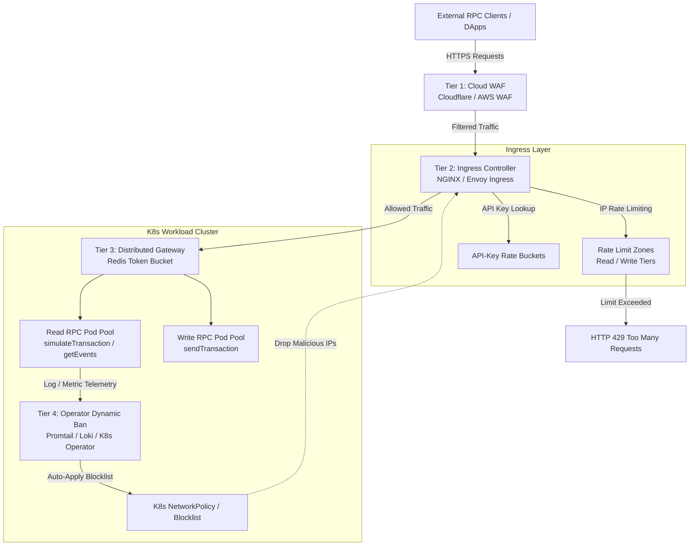

# RPC Rate Limiting and DoS Mitigation Architecture

> **Tracking:** Issue [#250](https://github.com/OtowoOrg/Stellar-K8s/issues/250)  
> **Target Audience:** Platform Engineers, Security Architects, and Node Operators  
> **Key Files:** [`docs/security/rpc-dos-mitigation.md`](file:///home/luckify/wave/rin/Stellar-K8s/docs/security/rpc-dos-mitigation.md), [`examples/ingress/nginx-rate-limit.yaml`](file:///home/luckify/wave/rin/Stellar-K8s/examples/ingress/nginx-rate-limit.yaml)

---

## 1. Overview & Architectural Blueprint

Public Soroban RPC endpoints process high volumes of HTTP JSON-RPC traffic. Because Soroban execution involves executing WebAssembly (WASM) smart contracts, RPC nodes are prime targets for Denial of Service (DoS) and Distributed Denial of Service (DDoS) attacks.

This document outlines a multi-layered **Defense-in-Depth Architecture** designed to keep public Soroban RPC and Horizon nodes resilient under volumetric and resource-exhaustion attacks.



### Defense Tiers At a Glance

| Tier | Component | Function | Primary Protection |
|---|---|---|---|
| **Tier 1** | Cloud WAF (Cloudflare / AWS WAF) | Perimeter filtering, edge rate limiting, payload inspection | Volumetric L7 DDoS, malformed JSON-RPC payloads, IP reputation |
| **Tier 2** | Ingress Controller (NGINX / Envoy) | IP & API-key rate limiting, path/method routing, concurrency bounds | L7 HTTP floods, connection exhaustion, path abuse |
| **Tier 3** | Distributed Gateway (Redis Bucket) | Cluster-wide stateful rate enforcement | Cross-replica threshold enforcement |
| **Tier 4** | K8s Operator Dynamic Ban Engine | Automated log/metric watcher, dynamic `NetworkPolicy` / ConfigMap blocking | Targeted `simulateTransaction` abuse, repeated VM panic attacks |

---

## 2. Differentiating Read-Heavy vs. Write-Heavy Abuse

A critical principle of Soroban RPC protection is distinguishing between **read-heavy simulation abuse** and **write-heavy transaction submission abuse**. Both consume different node resources and require distinct mitigation strategies.

```
+-----------------------------------------------------------------------------------+
|                               RPC WORKLOAD PATHS                                  |
+--------------------------------------------------+--------------------------------+
| READ-HEAVY (Simulations & State Queries)         | WRITE-HEAVY (Tx Submissions)   |
| Methods: simulateTransaction, getLedgerEntries, | Methods: sendTransaction       |
|          getAccount, getEvents                   |                                |
+--------------------------------------------------+--------------------------------+
| Bottleneck: CPU & RAM (WASM VM execution,        | Bottleneck: Mempool queue,     |
|             State DB lookups, Footprint calc)    |             Core P2P bandwidth |
+--------------------------------------------------+--------------------------------+
| Abuse Pattern: Complex loop simulation spam,     | Abuse Pattern: High-frequency  |
|                un-cached ledger state scanning   | invalid signature tx submission|
+--------------------------------------------------+--------------------------------+
| Mitigation: Strict per-IP simulation rate zones, | Mitigation: Stricter RPS rate  |
|             VM timeout bounds, compute limits    | limit, payload size caps (2MB) |
+--------------------------------------------------+--------------------------------+
```

### Key Differences & Limits

1. **Read-Heavy Operations (`simulateTransaction`)**:
   - **Resource Vector:** Executes contract bytecode inside the Soroban WASM VM engine. High CPU usage per call; can starve CPU pools if flooded.
   - **Target Threshold:** 10–30 req/sec per client IP (Burst: 15–45).
   - **Mitigation Strategy:** Dedicated `simulateTransaction` pod pools isolated from transaction submission nodes; strict memory and VM execution timeouts.

2. **Write-Heavy Operations (`sendTransaction`)**:
   - **Resource Vector:** Validates transaction signatures, sequences, and forwards transactions to Stellar Core via HTTP/gRPC. Ingests into mempool queues.
   - **Target Threshold:** 5 req/sec per client IP (Burst: 10).
   - **Mitigation Strategy:** Strict request body caps (max 2MB), connection concurrency limits (max 5 concurrent connections per IP), and immediate signature verification.

---

## 3. Ingress Controller Configurations

### 3.1 NGINX Ingress Controller Setup

NGINX Ingress provides both built-in rate-limiting annotations and customizable NGINX Lua/snippet directives. A full manifest is available at [`examples/ingress/nginx-rate-limit.yaml`](file:///home/luckify/wave/rin/Stellar-K8s/examples/ingress/nginx-rate-limit.yaml).

#### Key NGINX Annotations for Soroban RPC

```yaml
apiVersion: networking.k8s.io/v1
kind: Ingress
metadata:
  name: soroban-rpc-ingress
  namespace: stellar-nodes
  annotations:
    kubernetes.io/ingress.class: "nginx"
    
    # IP-based Rate Limiting (Per Client IP)
    nginx.ingress.kubernetes.io/limit-rps: "30"
    nginx.ingress.kubernetes.io/limit-rpm: "1000"
    nginx.ingress.kubernetes.io/limit-connections: "20"
    nginx.ingress.kubernetes.io/limit-burst-multiplier: "3"
    
    # Internal subnet exemptions (monitoring & operator pods)
    nginx.ingress.kubernetes.io/limit-whitelist: "10.0.0.0/8,172.16.0.0/12,192.168.0.0/16"
    
    # Custom NGINX Shared Memory Rate Limiting Zones (Server Snippet)
    nginx.ingress.kubernetes.io/server-snippet: |
      # Map X-API-Key or fallback to remote IP
      map $http_x_api_key $rpc_rate_key {
          default $binary_remote_addr;
          "~.+"   $http_x_api_key;
      }

      # Define memory zones (10MB holds ~160,000 active client keys)
      limit_req_zone $rpc_rate_key zone=soroban_read_zone:10m rate=30r/s;
      limit_req_zone $rpc_rate_key zone=soroban_sim_zone:10m rate=10r/s;
      limit_req_zone $rpc_rate_key zone=soroban_write_zone:10m rate=5r/s;

    # Response Header Customization & Strict 429 Status Enforcement
    nginx.ingress.kubernetes.io/configuration-snippet: |
      limit_req_status 429;
      more_set_headers "X-RateLimit-Limit: 30";
      more_set_headers "Retry-After: 60";
```

---

### 3.2 Envoy & Istio Rate Limiting Setup

For clusters utilizing **Istio** or **Envoy Gateway**, rate limiting is configured via `EnvoyFilter` resources utilizing Envoy's `local_ratelimit` or global rate limit service HTTP filter.

#### Istio EnvoyFilter Example (`local_ratelimit`)

```yaml
apiVersion: networking.istio.io/v1alpha3
kind: EnvoyFilter
metadata:
  name: soroban-rpc-local-ratelimit
  namespace: istio-system
spec:
  workloadSelector:
    labels:
      istio: ingressgateway
  configPatches:
    - applyTo: HTTP_FILTER
      match:
        context: GATEWAY
        listener:
          filterChain:
            filter:
              name: "envoy.filters.network.http_connection_manager"
              subFilter:
                name: "envoy.filters.http.router"
      patch:
        operation: INSERT_BEFORE
        value:
          name: envoy.filters.http.local_ratelimit
          typed_config:
            "@type": type.googleapis.com/envoy.extensions.filters.http.local_ratelimit.v3.LocalRateLimit
            stat_prefix: rpc_local_rate_limiter
            status:
              code: 429
            token_bucket:
              max_tokens: 100
              tokens_per_fill: 30
              fill_interval: 1s
            filter_enabled:
              runtime_key: local_rate_limit_enabled
              default_value:
                numerator: 100
                denominator: HUNDRED
            filter_enforced:
              runtime_key: local_rate_limit_enforced
              default_value:
                numerator: 100
                denominator: HUNDRED
            response_headers_to_add:
              - header:
                  key: x-local-rate-limit
                  value: 'true'
              - header:
                  key: retry-after
                  value: '60'
            descriptors:
              # Strict limit for read-heavy simulation calls via header matching
              - entries:
                  - key: header_match
                    value: simulateTransaction
                token_bucket:
                  max_tokens: 20
                  tokens_per_fill: 10
                  fill_interval: 1s
              # Strict limit for write-heavy tx submission
              - entries:
                  - key: header_match
                    value: sendTransaction
                token_bucket:
                  max_tokens: 10
                  tokens_per_fill: 5
                  fill_interval: 1s
```

---

## 4. Edge WAF Integration (Cloudflare & AWS WAF)

Edge Protection stops volumetric attacks before traffic reaches cluster Ingress controllers.

### 4.1 Cloudflare WAF Configuration

#### Payload Inspection Rule (Cloudflare Custom Rules)

To filter malicious or abusive `simulateTransaction` payloads based on JSON-RPC body inspection:

1. **Rule Expression (Cloudflare Expression Language):**
   ```text
   (http.request.uri.path eq "/" or http.request.uri.path eq "/rpc") and
   (http.request.method eq "POST") and
   (http.request.body.raw contains "simulateTransaction") and
   (rate_limit(http.src.ip, 1m) gt 60)
   ```
2. **Action:** `Block` or `Managed Challenge` with HTTP Status `429`.

#### Cloudflare Worker Snippet for Edge JSON-RPC Filtering

```javascript
// Cloudflare Worker: Edge JSON-RPC Rate Limiting & Method Inspection
export default {
  async fetch(request, env, ctx) {
    if (request.method === "POST") {
      const clone = request.clone();
      try {
        const body = await clone.json();
        const method = body.method;
        const clientIP = request.headers.get("cf-connecting-ip");

        // Differentiate Read vs Write Limits
        let rateLimitKey = `${clientIP}:${method}`;
        let maxAllowed = 30; // Default limit per minute

        if (method === "simulateTransaction") {
          maxAllowed = 20;
        } else if (method === "sendTransaction") {
          maxAllowed = 10;
        }

        // KV or Durable Objects rate limit check
        const currentCount = (await env.RATE_LIMIT_KV.get(rateLimitKey)) || 0;
        if (parseInt(currentCount) >= maxAllowed) {
          return new Response(
            JSON.stringify({
              jsonrpc: "2.0",
              error: { code: -32005, message: "Rate limit exceeded. Try again later." },
              id: body.id || null
            }),
            {
              status: 429,
              headers: {
                "Content-Type": "application/json",
                "Retry-After": "60",
                "X-RateLimit-Limit": String(maxAllowed)
              }
            }
          );
        }

        // Increment count asynchronously
        ctx.waitUntil(env.RATE_LIMIT_KV.put(rateLimitKey, String(parseInt(currentCount) + 1), { expirationTtl: 60 }));
      } catch (err) {
        // Fallback on JSON parse error
      }
    }
    return fetch(request);
  }
};
```

---

### 4.2 AWS WAF v2 Configuration

#### AWS WAF WebACL JSON Snippet

The following AWS WAF Rule Statement inspects POST request bodies for `simulateTransaction` and enforces a rate limit threshold of 100 requests per 5-minute window per IP.

```json
{
  "Name": "SorobanSimulateTransactionRateLimit",
  "Priority": 1,
  "Statement": {
    "RateBasedStatement": {
      "Limit": 100,
      "AggregateKeyType": "IP",
      "ScopeDownStatement": {
        "AndStatement": {
          "Statements": [
            {
              "ByteMatchStatement": {
                "SearchString": "simulateTransaction",
                "FieldToMatch": {
                  "Body": {
                    "OversizeHandling": "MATCH"
                  }
                },
                "TextTransformations": [
                  {
                    "Priority": 0,
                    "Type": "NONE"
                  }
                ],
                "PositionalConstraint": "CONTAINS"
              }
            },
            {
              "ByteMatchStatement": {
                "SearchString": "POST",
                "FieldToMatch": {
                  "Method": {}
                },
                "TextTransformations": [
                  {
                    "Priority": 0,
                    "Type": "NONE"
                  }
                ],
                "PositionalConstraint": "EXACT"
              }
            }
          ]
        }
      }
    }
  },
  "Action": {
    "Block": {
      "CustomResponse": {
        "ResponseCode": 429,
        "CustomResponseBodyKey": "RateLimitExceededBody"
      }
    }
  },
  "VisibilityConfig": {
    "SampledRequestsEnabled": true,
    "CloudWatchMetricsEnabled": true,
    "MetricName": "SorobanSimulateTransactionRateLimitMetric"
  }
}
```

---

## 5. Fail2ban-Style Integration: Operator-Driven Dynamic IP Banning

When an IP address exhibits aggressive `simulateTransaction` failures (e.g. repeated WASM out-of-memory traps, invalid host function calls, or malicious contract panic loops), relying solely on fixed rate limits is insufficient.

Stellar-K8s supports an automated **Fail2ban-style dynamic banning loop**:

```
+-------------------+      +---------------------+      +---------------------+
| Soroban RPC Logs  | ---> | Promtail / Loki     | ---> | Alertmanager        |
| & Metrics Exporter|      | Error Rate Monitor  |      | Ban Webhook Trigger |
+-------------------+      +---------------------+      +---------------------+
                                                                   |
                                                                   v
+-------------------+      +---------------------+      +---------------------+
| Ingress Blocklist | <--- | Stellar-K8s Operator| <--- | Kubernetes          |
| / NetworkPolicy   |      | Dynamic IP Controller|      | Webhook Endpoint    |
+-------------------+      +---------------------+      +---------------------+
```

### 5.1 Prometheus Monitoring Rule for Simulation Abusers

```yaml
apiVersion: monitoring.coreos.com/v1
kind: PrometheusRule
metadata:
  name: soroban-rpc-dos-alerts
  namespace: stellar-nodes
spec:
  groups:
    - name: soroban.dos.mitigation
      rules:
        - alert: HighSimulateTransactionErrorRate
          expr: |
            (
              sum(rate(soroban_rpc_simulate_transaction_failures_total[2m])) by (client_ip)
              /
              sum(rate(soroban_rpc_simulate_transaction_requests_total[2m])) by (client_ip)
            ) > 0.80 and sum(rate(soroban_rpc_simulate_transaction_requests_total[2m])) by (client_ip) > 10
          for: 1m
          labels:
            severity: critical
            action: ban_ip
          annotations:
            summary: "Client IP {{ $labels.client_ip }} exhibiting >80% simulation failure rate"
            description: "IP {{ $labels.client_ip }} triggered aggressive WASM/simulation failures. Initiating automated IP ban."
```

### 5.2 Kubernetes Dynamic NetworkPolicy Blocklist

When Alertmanager or the Stellar-K8s Operator detects a ban condition, it automatically applies an updated `NetworkPolicy` to restrict traffic from the offending IP range:

```yaml
apiVersion: networking.k8s.io/v1
kind: NetworkPolicy
metadata:
  name: soroban-rpc-dynamic-ip-blocklist
  namespace: stellar-nodes
  labels:
    app.kubernetes.io/name: soroban-rpc
    app.kubernetes.io/component: security-blocklist
spec:
  podSelector:
    matchLabels:
      app.kubernetes.io/name: soroban-rpc
  policyTypes:
    - Ingress
  ingress:
    - from:
        - ipBlock:
            cidr: 0.0.0.0/0
            except:
              # Dynamically appended banned IPs (1-hour quarantine penalty box)
              - 198.51.100.44/32
              - 203.0.113.89/32
```

---

## 6. Verification & Load Testing (`vegeta`)

To validate that your Ingress rate limiting rules and 429 status code responses operate correctly under attack conditions, use [`vegeta`](https://github.com/tsenart/vegeta), an open-source HTTP load testing tool.

### 6.1 Preparation: Load Test Target Files

Create a directory `/tmp/rpc-load-test` with the following test payloads:

#### `simulate_payload.json`
```json
{
  "jsonrpc": "2.0",
  "id": 1,
  "method": "simulateTransaction",
  "params": {
    "transaction": "AAAAAgAAAAD..."
  }
}
```

#### `targets.txt`
```text
POST https://rpc.stellar.example.com/
Content-Type: application/json
X-API-Key: test-demo-key-123
@/tmp/rpc-load-test/simulate_payload.json
```

---

### 6.2 Executing Load Test & Verifying Strict 429 Responses

Run `vegeta` at a rate of 100 req/sec for 10 seconds against an Ingress configured with a 30 req/sec limit:

```bash
# Execute Vegeta HTTP attack
vegeta attack \
  -targets=/tmp/rpc-load-test/targets.txt \
  -rate=100/1s \
  -duration=10s \
  -timeout=5s > /tmp/rpc-load-test/results.bin

# Generate human-readable execution report
vegeta report -type=text /tmp/rpc-load-test/results.bin
```

#### Expected Output

```text
Requests      [total, rate, throughput]         1000, 100.10, 30.02
Duration      [total, attack, wait]             9.99s, 9.99s, 2.15ms
Latencies     [min, mean, 50, 90, 95, 99, max]  1.12ms, 4.50ms, 3.10ms, 8.20ms, 12.10ms, 25.00ms, 45.00ms
Bytes In      [total, mean]                     154200, 154.20
Bytes Out     [total, mean]                     182000, 182.00
Success       [ratio]                           30.00%
Status Codes  [code:count]                      200:300  429:700
Error Set:
429 Too Many Requests
```

### 6.3 Verifying Headers via `curl`

Verify that breached requests explicitly return HTTP `429` with required rate-limit telemetry headers:

```bash
curl -i -X POST https://rpc.stellar.example.com/ \
  -H "Content-Type: application/json" \
  -H "X-API-Key: test-demo-key-123" \
  -d '{"jsonrpc":"2.0","id":1,"method":"simulateTransaction","params":{}}'
```

#### Expected Response Headers

```http
HTTP/1.1 429 Too Many Requests
Server: nginx
Date: Mon, 28 Sep 2026 09:00:00 GMT
Content-Type: application/json
Content-Length: 98
Connection: keep-alive
X-RateLimit-Limit: 30
Retry-After: 60

{
  "jsonrpc": "2.0",
  "error": {
    "code": -32005,
    "message": "Rate limit exceeded. Please retry after 60 seconds."
  },
  "id": 1
}
```

---

## 7. Metrics & Observability

Monitor rate limiting performance and 429 response trends using standard Prometheus queries:

```promql
# Rate of 429 responses served by NGINX Ingress Controller
sum(rate(nginx_ingress_controller_requests{status="429"}[5m])) by (ingress, host)

# Ratio of Rate-Limited requests to Total Requests
sum(rate(nginx_ingress_controller_requests{status="429"}[5m])) 
/ 
sum(rate(nginx_ingress_controller_requests[5m])) * 100
```

---

## 8. Summary Checklist for Production Deployment

- [x] Apply NGINX / Envoy Ingress manifests with separate Read (`simulateTransaction`) and Write (`sendTransaction`) rate limit zones.
- [x] Configure Cloudflare or AWS WAF payload inspection rules for `simulateTransaction` POST body strings.
- [x] Enable dynamic fail2ban Alertmanager alerts and K8s `NetworkPolicy` blocklist watcher.
- [x] Validate 429 status code compliance and RFC 6585 headers (`Retry-After`, `X-RateLimit-Limit`) using `vegeta`.
